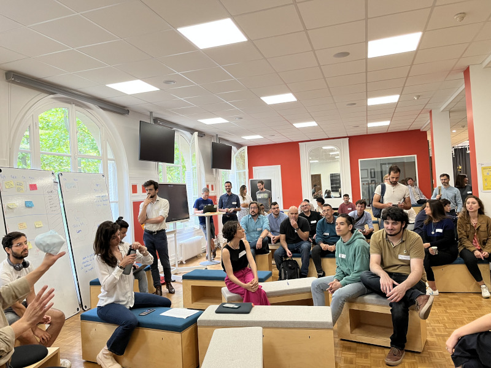

# Le forum mensuel beta.gouv.fr

Depuis mai 2022, tous les mois, le réseau des incubateurs de startups d’État se réunit lors d’un rendez-vous mensuel des membres du réseau [beta.gouv.fr](http://beta.gouv.fr/).

Chaque mois, entre 60 et 100 membres de la communauté [beta.gouv.fr](http://beta.gouv.fr/) participent à cette journée : intrapreneurs et intrapreneuses, développeurs et développeuses, responsables d’incubateurs ministériels, coachs, designers, e

Il s’agit d’une journée de rencontres et d’échanges en présentiel pour favoriser le partage d’expérience entre les différentes équipes de Startups d’État et les différents ministères.

## Informations pratiques

**👉 Les informations pratiques, date, heure et lieu sont disponibles sur l'**[**agenda public**](https://calendar.google.com/calendar/embed?src=0ieonqap1r5jeal5ugeuhoovlg%40group.calendar.google.com\&ctz=Europe%2FParis) **de beta.gouv.fr**


**Déroulé-type d'un Forum beta.gouv.fr**

Rdv de 10h à 18h, pour une journée au format [Forum ouvert](https://fr.wikipedia.org/wiki/M%C3%A9thodologie_Forum_Ouvert) : l’ordre du jour est défini par les participants.

* A **10h**, chaque participant peut s'il le souhaite présenter un sujet et l'inscrire à l'ordre du jour en l'inscrivant sur le tableau central
* De **12h00 à 12h45**, nous nous retrouvons en plénière pour **le Stand Up de beta.gouv** : tour de l’actualité des Startups présentes et de leur ministère
* De **16h00 à 17h00**, se tiennent **les clubs métiers** (dev, bizdev, design, coach, intra, incubateur)


## Présence

La présence est volontaire et totalement optionnelle.

* La journée est ouverte à toutes les personnes du réseau beta.gouv, quel que soit votre incubateur de rattachement et votre statut (agents publics, indépendant·e·s, salarié·e·s de sociétés de prestations)
* On a le droit de ne pas venir
* On a le droit de venir puis de quitter la salle du forum quand on le souhaite, ou de se poser dans un coin pour télétravailler
* On a le droit de venir certains mois et pas d'autres

## Quels sujets sont abordés au forum ?

Tout sujet d'intérêt transverse est bienvenu. Les sujets sont proposés sur un tableau blanc affiché dans la salle du forum.

Quelques exemples de sujets qui ont été abordés lors des derniers forums :

* Démonstration de la dernière version de mon produit numérique
* Comment gérer la pérennisation de ma startup d'État ?
* Quels outils pour passer à l'échelle ?
* Comment convaincre mon administration de transformer ses pratiques ?

Nous encourageons la nomination d'un·e **scribe** volontaire dans chacun des ateliers, qui peut prendre des notes dans un [pad](../../../jutilise-les-outils-de-la-communaute/pad.md) et les partager, par exemple, dans l'espace Mattermost le plus adéquat.
