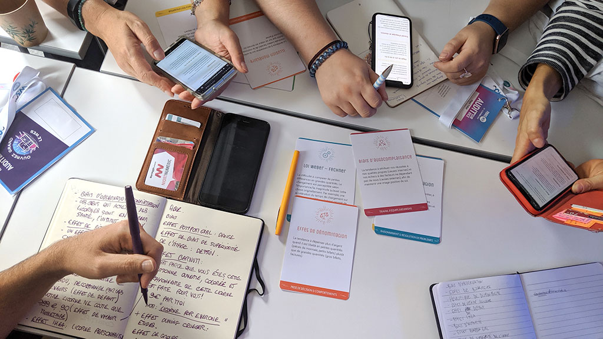

# Les biais

**“Je me suis mis à la place de mon utilisateur”** est une phrase que l’on entend trop souvent dans les équipes. Et pour cause, on ne peut pas se mettre à la place des autres.&#x20;

* Personne ne peut **ressentir la douleur**, notamment la honte, rencontrés par une personne qui a des difficultés à lire.&#x20;
* Personne ne peut **imaginer les difficultés** auxquelles une personne trans doit faire face quotidiennement. Parce qu'au-delà de nos services, elle peut se faire insulter voire pire, agresser parce qu’elle est qui elle est.

La bonne approche consiste à **avoir l’attitude d’une chercheuse ou d’un chercheur** pour rencontrer et prendre en compte d’autres perspectives que la vôtre. On ne voit le monde que d’un seul point de vue : le sien. On peut aussi le  voir à travers celui de son entourage, celui de son équipe ou de son environnement immédiat. On voit aussi le monde à travers sa ou ses cultures. Il est extrêmement difficile de prendre conscience de ses propres biais.

Lorsque vous n’allez pas à la rencontre de personnes ou de groupes aux vécus différents du vôtre, vous posez votre réalité en norme. Cette norme devient la base de conception, mais c'est une vision tronquée de la réalité. Par ricochet, vous mettez de côté toutes les personnes qui n’ont pas le même vécu que vous.

Les biais peuvent être liés à :&#x20;

* la culture&#x20;
* le genre&#x20;
* l’éducation&#x20;
* la société&#x20;
* la religion&#x20;
* un handicap etc.

Les biais ne sont pas forcément négatifs, mais ils contribuent à nous faire prendre de mauvaises décisions. Il est important de faire preuve d’**esprit critique**. On ne peut pas éviter tous les biais, mais on peut en limiter les effets.

Les **biais cognitifs** sont aussi à prendre en compte, parce qu’ils nous influencent dans notre vie quotidienne. D’après le _Grand Dictionnaire de la Psychologie, Larousse_, 1991 : "un biais est une distorsion (déviation systématique par rapport à une norme) que subit une information en entrant dans le système cognitif ou en sortant. Dans le premier cas, le sujet opère une sélection des informations. Dans le second, il réalise une sélection des réponses."

### Quelques questions à se poser :

* [ ] Quels sont mes biais ?&#x20;
* [ ] Comment peuvent-ils impacter le projet ?&#x20;
* [ ] Quelles sont les perspectives à prendre en compte pour améliorer le projet  ?&#x20;
* [ ] Comment puis-je entendre la voix des personnes qui ont d’autres expériences ?&#x20;
* [ ] Quelles sont mes sources d’information ?&#x20;
* [ ] Ces sources sont-elles susceptibles d’être biaisées ? Si oui, comment et pourquoi ?

### Pour aller plus loin :

* **RESSOURCE :**  [Les biais cognitif ](https://fr.wikipedia.org/wiki/Biais\_cognitif)(wikipédia)&#x20;
* **ATELIER :** Jeu de [52 Cartes sur les biais cognitifs](https://stephaniewalter.design/fr/blog/a-la-decouverte-des-biais-cognitifs-le-jeu-de-52-cartes/) par Stéphanie Walter&#x20;

****
