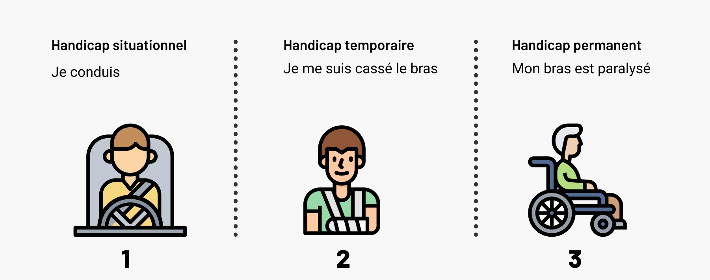

# Introduction

### L'accessibilité, un droit pour toutes et tous

L’accessibilité numérique est un **droit** pour toutes et tous d’utiliser les services numériques, quelle que soit leur façon d’y accéder.

Aujourd'hui, **un français sur 5** est ou sera confronté à une situation de handicap temporaire ou permanente. Ces handicaps \(auditifs, cognitifs, neurologiques, physiques, verbaux ou encore visuels\) peuvent affecter la manière dont une personne accède et contribue au Web.


_« Oui, mais nous, on est pas concernés, nos utilisateurs ne sont pas handicaptés »_ : c'est faux ! **80 % des handicaps sont invisibles**. Les personnes qui utilisent votre service numérique peuvent être dyslexiques, migraineux ou daltonien, sans que vous n'en sachiez rien.


**Un service accessible est un service qu'une personne handicapée peut utiliser, sans obstacle.**

### Quelle différence entre accessibilité et design inclusif ?


**L’accessibilité est essentielle pour les personnes handicapées**, mais également **utile** pour tous.


* Le **design inclusif**, c’est penser à toutes et tous, quelque soit le lieu de vie, la situation économique, le niveau d’éducation, la barrière de la langue, l’âge, le genre ou les handicaps d’une personne. 
* **L’accessibilité**, elle, est plus particulièrement orientée à destination des personnes handicapés : sans elle, une personne handicapé peut difficilement, ou pire pas du tout, accéder à un service numérique.

Concrètement, **les deux démarches sont donc profondément imbriquées** car l’accessibilité profite souvent à tous. Par exemple, en construisant une application de navigation accessible à une personne handicapée, le service sera aussi accessible à une personne temporairement handicapée \(bras cassé par exemple\) ou une personne avec une incapacité contextuelle \(en train de conduire\).

Pour autant, **design inclusif et accessibilité n'ont pas les mêmes enjeux** : le design inclusif facilite les usages pour tous quand **l'accessibilité est indispensable** pour certains.


On parle parfois de **a11y**, qui est la contraction du terme anglais **accessibility** avec les première lettre _a_, le nombre de lettres entre celle-ci et la dernière, et la dernière lettre _y_.


