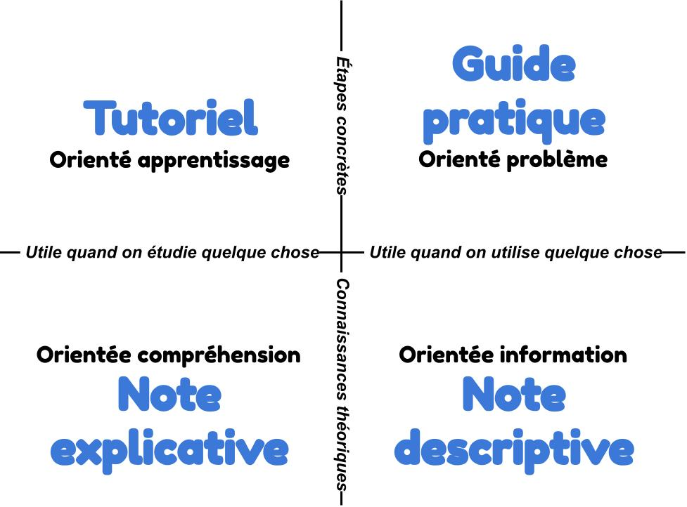

# Les 4 types de documentation

D’après [Daniele Procida](https://www.writethedocs.org/videos/eu/2017/the-four-kinds-of-documentation-and-why-you-need-to-understand-what-they-are-daniele-procida/), Il existe quatre fonctions différentes qui ont chacune leur mode d’écriture propre :

* **le tutoriel** pour aider l'utilisateur à **démarrer,**
* **le guide pratique** pour aider l'utilisatrice à **atteindre un objectif ou résoudre un problème**,
* **la note descriptive** pour **informer** l'utilisateur sur un sujet spécifique ou le produit,
* **le note explicative** pour **clarifier** les choix d'un sujet ou du produit.

## Tableau comparatif des 4 types de documentation

|                         | **Tutoriel**                               | **Guide pratique**                   | **Note descriptive**                                                  | **Note explicative**                                             |
| ----------------------- | ------------------------------------------ | ------------------------------------ | --------------------------------------------------------------------- | ---------------------------------------------------------------- |
| **Synonymes**           | Tuto, livret de démarrage...               | Pas-à-pas, manuel, ...               | Wiki, note de référence, matériel de référence, liste de référence... | Discussion thématique, Note explicative, argumentaire, notice... |
| **Vise à**              | Apprendre                                  | Atteindre un objectif                | Informer                                                              | Comprendre un sujet spécifique                                   |
| **Doit**                | Permettre de démarrer                      | Montrer comment résoudre un problème | Décrire un système                                                    | Clarifier un sujet et être axé sur la compréhension              |
| **Prend la forme**      | Une leçon                                  | Un processus à suivre                | Une description                                                       | Une explication logique ou une discussion sur un sujet           |
| **Peut être comparé à** | Apprendre à un enfant à préparer un gâteau | Une recette de cuisine               | Un article d’encyclopédie                                             | 
Un article d’histoire sociale de la cuisine 
           |

### Quelques conseils par type de documentation



* Ne doit servir qu’à expliquer à l’utilisateur comment il doit démarrer.
* Permettre à l’utilisateur d’apprendre en faisant
* Il faut l’aider à démarrer son voyage et non à arriver à sa destination finale
* Il est impératif que les étapes de votre tutoriel marchent vraiment.
* Diviser votre tutoriel en courte étape où des résultats sont visibles rapidement.
* Rendez votre modèle de tutoriel réplicable
* Orienter votre lecteur sur des éléments concrets et non abstraits.
* N’essayez pas d’apporter des explications
* Utiliser des verbes d’action pour décrire les tâches à suivre\\



* Ne doit servir qu’à répondre à une question qu’un utilisateur, avec un peu d’expérience, pourrait se poser
* Liste des étapes à suivre (seul point commun avec un tutoriel)
* Ce que vous écrivez ne doit servir qu’au but à atteindre
* Le problème à résoudre doit être spécifique : “Comment résoudre x ? ”
* Le but n’est pas d’expliquer
* Vous pouvez proposer plusieurs chemins pour chaque problème à résoudre
* Faites pratique et non exhaustif
* Donner un titre adapté à votre guide : “ Comment créer… ? ”\\



* La rédaction doit être plus qualitative et exhaustive que pour un tutoriel ou un guide pratique.
* Ne décrivez pas comment faire mais comment c’est fait : tout décrire clairement.
* Illustrer avec des exemples
* Eviter d’essayer de décrire comment réaliser des tâches. Dans ce cas-là, privilégiez un lien vers le tutoriel ou le guide.
* Soyez précis dans vos descriptions et le plus à jour possible\\



* Donner du contexte et essayer d’expliquer “pourquoi?”
* Raconter les alternatives envisagées
* Ne rentrez pas dans des explications techniques\\



### Schéma illustrant les 4 types de documentation


Ce texte est une traduction librement inspirée de "[Write The Doc](https://www.writethedocs.org/videos/eu/2017/the-four-kinds-of-documentation-and-why-you-need-to-understand-what-they-are-daniele-procida/)" - CC BY-NC-SA 4.0

