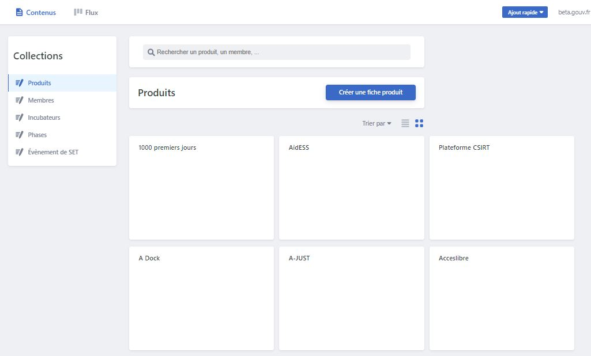

# Gérer sa fiche produit

La fiche produit est la page qui présente chaque Startup d'État sur la page Réalisations du site beta.gouv.fr.



La fiche produit se présente en général en trois parties principales :

* _le drame_ : chaque année… tel problème se répète… il cause des €, du temps perdu, du gaspillage, des arrêts maladie, de la violence, de l’exclusion…
* _la solution numérique_ : comment ça marche ? « grâce à MonSuperService, chaque collectivité va pouvoir enfin… chaque citoyen pourra enfin… », en quoi se différencie-t-elle de l’offre actuelle ? Pourquoi est-elle unique ?
* _la stratégie de mise en marché_ : autour des premiers partenaires, comment se développent les usages ? Qui sont les prescripteurs ? Quel est le principal effet levier qui permet un impact fort en limitant les ressources de votre équipe ?

## Créer, modifier, gérer sa fiche produit


[Accéder à l'outil de gestion des fiches produits](https://beta.gouv.fr/admin/#/)



Besoin d'aide : [#incubateur-help](https://startups-detat.slack.com/archives/C1W35DTBP)


## Créer une fiche produit



## Ajouter un membre de son équipe à sa fiche produit


