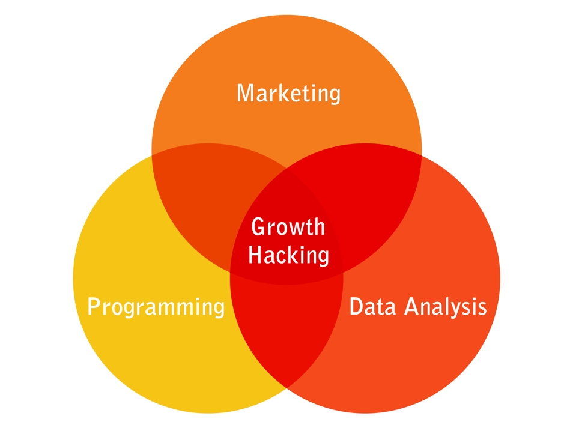

# Growth Hacking

## Le `Growth Hacking`, qu'est-ce que c'est ?

Le growth hacking \(GH\) recouvre toutes les tactiques d'acquisition, de conversion \(activation\), de rétention \(fidélisation\) d'utilisateurs d'une startup. Ils participent à augmenter l'impact d'un produit. 

Le GH permet donc de s'attaquer aux freins qui bloquent la  croissance organique de la SE, et donc l'augmentation de son impact:

* trop peu de personnes connaissent le service proposé 
* trop peu personnes s'inscrivent puis utilisent  le service
* trop peu de personnes utilisent régulièrement le service
* trop peu de personnes deviennent ambassadrices du service. 

Au final, l'impact est faible. 

C'est un mélange de marketing \(souvent digital\), d'ingénierie informatique, et d'analyse de données 

 Parmi ces tactiques :

* Framework AARRI™ : Acquisition, Activation, Rétention, Referral, Impact
* Découvrir et supprimer les freins à la croissance au niveau Marketing, Bizdev, Produit et Tech, 
* Webmarketing : SEM, SEO, SEA, Display, Remarketing, Emailing, CRM, Landing pages, Scrapping, GrowthHacking ;
* Automatisation, A/B testing, data-driven décisions et SaaS Analytics \(Matomo, Mixpanel, Metabase, etc\) ;
* Product and Sales Funnel optimisation. Acquisition de nouveaux usagers ;
* Dev frontend.

## Offre de service

L’offre de GH pour une SE peut se résumer à l’accompagner pour définir, implémenter , mesurer et améliorer/corriger le framework **AARRI : Acquisition, Activation, Rétention, Referral, Impact**

Celui-ci est une adaptation aux SE du framework de croissance AAARR, aussi appelé Startup Metrics for Pirates, ou encore Metrics Growth Hacking. La principale différence se situant sur la fin de ce funnel, le revenue étant remplacée par l’impact.

Ce dernier point n’est pas anodin, car c’est normalement le revenue qui permet de déterminer le cout d’acquisition cible \(le fameux ratio LTV/CAC\), mais aussi de déterminer les perspectives de ROI d’un investisseur, les besoins de financement futurs, la capacité d’embauche, etc.

Par ailleurs, à la différence du revenu, l’impact est pour une SE bien plus difficile à mesurer, voir à définir. Il peut même changer de nature avec un pivot. Pour une startup privée, un euro reste un euro, mais si elle le gagne différemment.

## Quelle est type de SE est concerné par le GH?

Le travail de GH peut concerner n’importe quelle SE, cependant, doit il doit s’adapter au niveau de croissance et de maturité de la SE.

Pour une SE en investigation/croissance, l’impact le plus fort sera sur la parti définition et implémentation de la partie la plus faible du framework de croissance AARRRI. A cette étape, on souhaite surtout mettre en place des outils de mesures et faire en sorte que l’équipe prenne ses décisions Bizdev et Produit en se basant sur la DATA ainsi obtenue, plutôt que sur l’intuition ou des opportunités externes.

Sur une SE en accélération, l’impact du GH sera optimum sur la partie Amélioration \(optimisation\).

C’est bien sûr ce dernier type de SE que l’impact du GH est le plus fort : une traction existe déjà, la mesure d’impact est identifiée et partagée par l’équipe. Presque aucun temps n’est consacré a identifié et mesurer un indicateur macro.

Les techniques de GH permettent alors d’identifier et mesurer des points de frictions qui ralentissent le passage à l’échelle, et de mettre en place des actions de correction et/ou d’optimisation sur un cycle de développement Lean/test&learn.

Pour résumer, et même si cela semble trivial, le GH est le plus utile pour une SE en croissance.

## Qui propose de l'aide ?

* \*\*\*\*[**Chaïb Martinez**](https://www.linkedin.com/in/chaibmartinez/?originalSubdomain=fr), Growth _engineer_ @beta

## Le format

* Interventions ponctuelles auprès de startups ;
* Ateliers collectifs en visio tous les mois. 👉 [**Plus de 20h en replay ici**](../jactive-la-croissance-de-ma-se-growth-hacking/les-principes-du-growth-hacking/)\*\*\*\*
* Aide au recrutement d'un.e Growth Hacker ou d'un Bizdev.  

## Comment demander de l'aide sur la croissance de votre produit ?

Sur Slack, ou par mail : **chaib.martinez@beta.gouv.fr**

