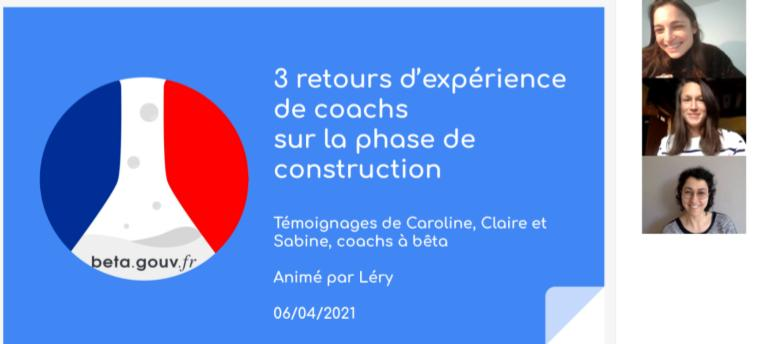

# 3 retours d'expérience de coachs


[Visionner le replay.](https://resana.numerique.gouv.fr/public/information/consulterAccessUrl?cle\_url=569601629CWMHZ1FdUm5XOgdhVTsGJlVrW2YAIVI7UzhXalEwDDYGMwUxA2YAZFVnVGQ=)


## Au sommaire de cet atelier :&#x20;

### 25 minutes d'échanges entre les 3 intervenantes sur :

1. **Comment bien démarrer une phase de construction ?**
2.  **Avez-vous mis en place un board de suivi ?**

    **Comment mettre du rythme et s’assurer de tenir les objectifs ?**
3. **Quels sont les principes qu’il faut absolument respecter ? et ceux qui seraient plus secondaires ?**
4. **Comment passer d’une logique de prestations (UX, Dev, coach) où l’on a chacun des compétences claires à un modèle d’équipe start-up où on avance ensemble et où l’on participe à des choses qui ne sont pas dans notre cœur de métier ?**
5. **Comment prioriser les demandes managériales externes?**

### 25 minutes de questions-réponses avec les 15 participants.

\
