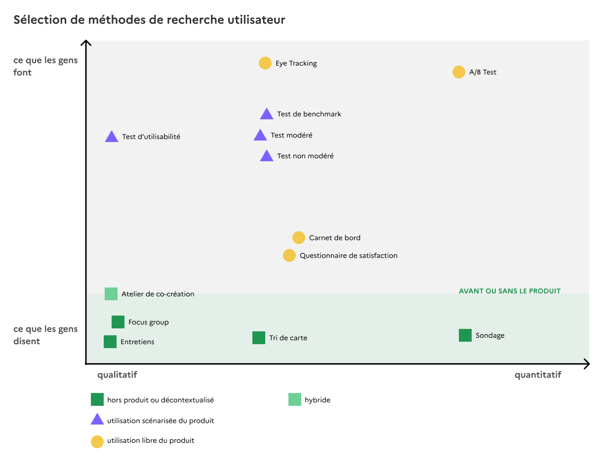

# Recherche utilisateur

## Faire des tests utilisateurs


**Fiche récap** [**Tests utilisateurs**](https://docs.google.com/document/d/1NHrwlGVDvzoctdAWmkvXwswWrQi3e7k_diTRks_0Lxo/edit?usp=sharing) **à imprimer**



**Présentation** [**Tests utilisateurs « faits maison »**](https://docs.google.com/presentation/d/1YWMdMD__ZIEkRBo8UUpI9hVdjTbRhsIGfIF4fPQXbd0/edit?usp=sharing) **pour s'auto-former à :**

* préparer ses tests utilisateurs
* tester dans de bonnes conditions
* analyser les résultats.


## Faire des entretiens utilisateurs


**Présentation** [**Entretiens utilisateurs**](https://docs.google.com/presentation/d/16XIfoFA5JYSnZZB-eomy22k8RlRo7qXnAakGZ0bpNO0/edit#slide=id.g73cc8a2fd8_0_101) **pour s'auto-former à :**

* organiser des entretiens exploratoires
* animer un entretien
* analyser les résultats


## Auditer l'expérience utilisateur de son service

Pourquoi réaliser un audit UX de mon produit ?

Pour identifier les principaux problèmes à corriger et avoir des propositions de solution.

Quel impact cela peut-il avoir sur mon produit ?

* Faciliter l’utilisation

- Améliorer la compréhension du service numérique
- Améliorer l’adoptabilité par les utilisateurs et utilisatric

Quand est-ce le bon moment pour réaliser un audit UX ?

Avant de lancer des tests d’utilisabilité auprès de vos utilisateurs.

Comment se passe un audit ?

* On définit le périmètre de l’audit, c’est-à-dire le (ou les) scénario utilisateur que vous souhaitez inspecter.

- On liste les tâches utilisateurs du scénario choisi.
- Un.e designer UX inspecte chacune des pages de votre produit.

Quel est le livrable d'un audit ?

Une liste des problèmes à corriger avec des propositions de solution.\

Les ressources sur l'audit UX

* [https://www.usabilis.com/ressources/audit-ergonomique/](https://www.usabilis.com/ressources/audit-ergonomique/)

- les critères ergonomiques : [https://www.ux-republic.com/criteres-ergonomiques-de-scapin-bastien/](https://www.ux-republic.com/criteres-ergonomiques-de-scapin-bastien/)

## Mesurer l'UX de son service


**Template de formulaire** [**Attrakdif simplifié**](https://docs.google.com/forms/d/1I2PGJa6WA1A8i83h1qEh47aYE71lgY5IjhsFMrKMbi4/edit?usp=sharing) **à dupliquer**


## Prioriser les fonctionnalités


[**Prioriser les fonctionnalités grâce aux retours utilisateurs**](prioriser-les-fonctionnalites-grace-aux-retours-utilisateurs.md)


## Cartographier l'expérience utilisateur (Experience map)

[Présentation de la méthode](https://docs.google.com/presentation/d/1nYbsL7YR9zo63Qk7Pc1gezXGti3c45FMwxFe5J9U_YY/edit?usp=sharing)
