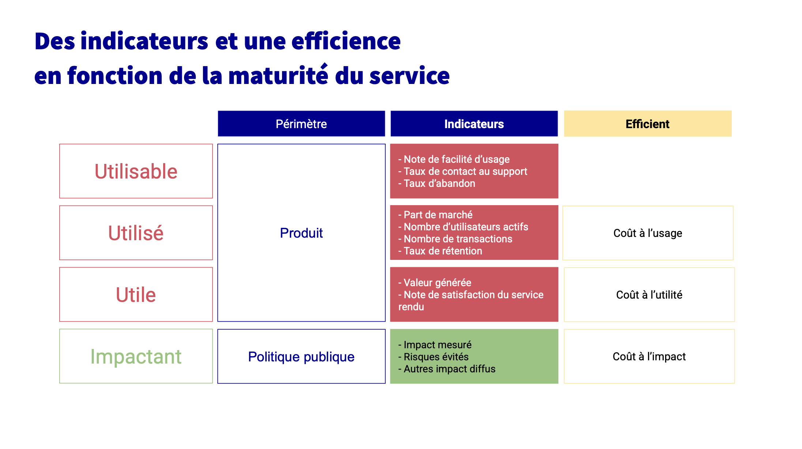

# ✴️ Matrice d'impact et pilotage de l'investissement

_Les services numériques publics doivent mesurer leur usage, leur impact et leur efficience afin de garantir leur exemplarité et seront évalués sur la base du respect des principes suivants._

## Introduction

Ce document sert de **point de repère pour évaluer les services numériques publics** selon une méthodologie commune, visant à fournir une image fidèle de leur pertinence et **facilitant la comparaison avec des services similaires**. Il vise à **guider les décisions d’investissement** en mettant l’accent sur l’impact des services numériques pour les usagers et la politique publique.  

L'impact et sa mesure font partie des [standards.beta.gouv.fr](https://standards.beta.gouv.fr/) à respecter pour utiliser le marché beta.

## Contexte

L’objectif d’un service numérique conçu selon l’approche Startup d’État, c’est d’atteindre un impact maximal, de préférence avec des retours sur investissement public croissants. Ainsi, **le coût annuel augmente moins vite que l’impact obtenu** (ou stagne, ou, mieux, baisse). **Pour atteindre cet impact maximal, il convient de séparer les effets du service numérique pour ses utilisateurs (utilité) des effets sur la politique publique (impact). Pour cela, on distingue 5 concepts clés.**

<figure><figcaption>
Matrice d'impact
</figcaption></figure>

### Un modèle de matrice et des exemples réels pour s'inspirer :


Le [modèle de matrice d'impact](https://docs.numerique.gouv.fr/docs/e59cbfd1-ffa0-4e07-a648-425bf724016e/) est disponible pour vous permettre de l'appliquer à votre produit.



Des [exemples de matrices d'impact](https://docs.numerique.gouv.fr/docs/7561923f-8bb9-4dc0-bdc1-06db6ab05055/) sont disponibles



Un [atelier pas à pas](https://docs.numerique.gouv.fr/docs/484e83a5-75ca-45fa-a2ad-2fded09beeca/) pour réaliser sa matrice d'impact **en équipe**


## Méthode d'évaluation

### Les principes évalués :

* **Utilisable** : un service est dit "utilisable" si le service est facile à comprendre et à prendre en main pour ses publics cibles. Il est accessible par tout le monde. En particulier, l’expérience n’est pas ressentie comme kafkaïenne, compliquée ou frustrante ;
* **Utilisé** : le service est dit "utilisé" est effectivement adopté par une part significative du public visé, qui s'en saisit dans les contextes et à la fréquence pertinente pour leurs besoins ;
* **Utile** : le service est dit "utile" s'il répond à un irritant réel et majeur pour ses utilisateurs. L'utilité est donc mesurée en fonction de la résolution d'un irritant qui doit pouvoir être formulé par : "J'en ai marre que / je souffre de ...". ;
* **Impactant** : le service est dit "impactant" s'il contribue positivement à la politique publique de façon mesurable, que ce soit en améliorant la vie des usagers ou l'efficacité des politiques publiques ;
* **Efficient** : le service délivre sa valeur à un coût proportionné, en limitant le gaspillage de ressources et en favorisant la mutualisation. Il représente un investissement pertinent pour la politique publique menée en comparaison d'autres services similaires.

### Les indicateurs pour les mesurer :

*   **Utilisable**

    *   **Indicateur obligatoire :**

        * **Note de facilité d’usage** : note moyenne attribuée par les utilisateurs pour indiquer si la prise en main du service est simple, fluide et agréable. Recommandation demander note entre 1 et 7

        **Autres exemples d' indicateurs :**

        * **Taux de contact du support** : proportion d’utilisateurs ayant sollicité de l’aide par rapport au nombre total d’utilisateurs.
        * **Taux d'abandon** : part des utilisateurs n'ayant pas accompli l'intégralité de leur démarche ou atteint la fin du parcours

* **Utilisé**
  *   **Indicateurs obligatoires :**

      * **Taux de pénétration sur le marché prioritaire** et évolution depuis 1 an
      * **Nombre d’utilisateurs actifs / mois** et évolution depuis 1 an: nombre d'utilisateurs uniques utilisant le service chaque mois.

      **Autres exemples d' indicateurs :**

      * **Part de marché** : proportion du public visé ayant utilisé le service sur une période donnée par rapport au nombre total d'utilisateurs potentiels pour ce public.
      * **Nombre de transactions/conversions / mois** : volume d'usage complet du service réalisé chaque mois (ex: demandes clôturée, simulation terminée, mise en relation effectuée, etc.).
      * **Taux de rétention**: part des nouveaux utilisateurs toujours actifs après une période donnée, considérée comme pertinente pour une réutilisation du service.

* **Utile**
  *   **Indicateur obligatoire :**

      * **Valeur générée**: indicateur mesurable d'un gain apporté aux utilisateurs (gain de temps, % résolution d'un problème, mise en relation, transmission d'information, simplification, accessibilité ...).

      **Autres exemples d'indicateurs :**

      * **Note de satisfaction du service rendu** : note moyenne ou Net Promoter Score (NPS entre -100 et +100).

* **Impactant\`**
  *   **Exemples d'indicateurs**

      * **Impact mesuré** : résultats positifs et quantifiables du service sur une politique publique (ex : taux de retour à l'emploi, baisse des émissions de CO2, etc.).
      * **Impact diffus** : effets positifs indirects ou non immédiatement mesurables (ex : montée en compétences, sensibilisation, etc.).
      * **Risques évités** : nombre ou nature des incidents, contentieux ou erreurs évités grâce au service.

* **Efficient**
  * **Indicateur obligatoire :**
    * **Budget sur l'année**: dépenses engagées pour le service sur l’année (AE).
    * **Coût à l’utilisation** : budget sur l'année / nombre d’utilisateurs actifs par mois (+ évolution par rapport à l’année dernière)
  * **Exemples d'indicateurs**
    * **Coût à l’utilité** : coût moyen rapporté aux nombre de problème effectivement résolu ou à la valeur générée (ex : X€ / heure de travail économisée).
    * **Coût à l’impact** : coût moyen par unité d’impact mesuré (ex : X€ / tonne de CO2 évitée).

## Exemples de services numériques

Cette méthode d'analyse de la pertinence des services numériques à été expérimentée sur plusieurs dizaines de Startups d'Etat, avec l'incubateur de l'ADEME, celui de la Justice, mais aussi avec le GIP de l'inclusion (suite à une demande de l'IGAS) et d'autres services de la communauté beta.gouv.fr.

Cette méthode peut aussi bien permettre d'analyser la pertinence d'un service numérique en mode projet qu'en mode produit, à condition que les services en questions soient déjà entre les mains des utilisateurs en condition réelle.

Dans le cas où le service numérique est encore au stade de projet, cette méthode permet surtout d'aider à anticiper les bonnes questions pour les débuts du service : que mesurer en terme d'usage, d'utilité, d'impact, et quel ratio d'efficience, soit de coût à l'impact espérer ? Et ainsi potentiellement réviser le budget prévu pour le projet, son périmètre ou l'approche.

Le succès est au rendez-vous quand les investissements des premières années portent leurs fruits. Par exemple, [https://refugies.info/](https://refugies.info/fr) a progressivement atteint un coût unitaire par visiteur informé optimal, démarrant à 50 € par visiteur informé en 2020 pour atteindre 0,90 € par visiteur informé en avril 2024.

## Références

Ce travail sur l'évaluation de la pertinence des services numériques porté par la DINUM, se base en grande partie sur l'expérience accumulée au sein de la communauté beta.gouv.fr depuis 10 ans.

Voici quelques éléments, non exhaustifs, qui ont permis d'enrichir cette doctrine :

* (Communauté beta.gouv.fr) [Petit guide du pilotage par l'impact](https://docs.google.com/presentation/d/1g_qAXXy28Kh7M3qgafXVbgcvjcJf9Euryy3X78L_2es/edit?usp=sharing)
* (ANSSI) [Matrice d'impact.pdf](https://resana.numerique.gouv.fr/public/information/consulterAccessUrl?cle_url=2082283578A2kEZFpWU29XOgRiBmhdfVJsDDEEJQlgUzhTbgNiWmIGMQMzVTEBZFFrAzcLMw==)
* (ANSSI) [Lab\_BrochureA5\_Mesurer.pdf](https://resana.numerique.gouv.fr/public/information/consulterAccessUrl?cle_url=1825398125B21QMAAMCDRcMQJkAW9dfVBuXGEGJwZvUDtXalw9CzMGMQQ0Wj4FYQMxV28KPA==)
* (FAST) [Piloter la croissance et Mesurer l'impact](https://docs.google.com/presentation/d/1IiQIFW27Run0mmIBe2r8Tf_3TTz9UZVzefe16yucoss/edit?usp=sharing)
