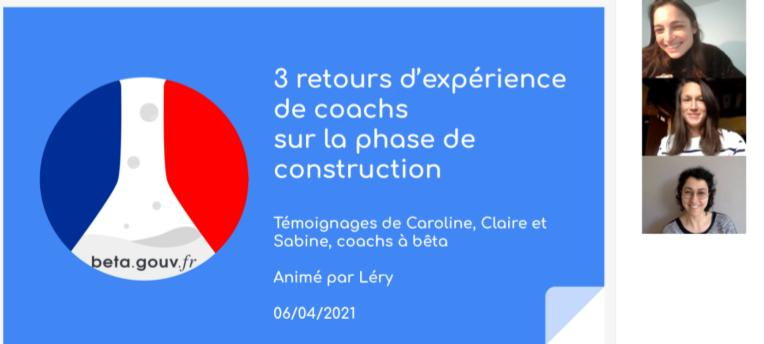

# 🟣 Retours d'expérience


[Visionner le replay.](https://resana.numerique.gouv.fr/public/information/consulterAccessUrl?cle_url=569601629CWMHZ1FdUm5XOgdhVTsGJlVrW2YAIVI7UzhXalEwDDYGMwUxA2YAZFVnVGQ=)


## Notes de la conférence

### 1- Comment bien démarrer une phase de construction ?

- **Se mettre d'accord sur les bases de la culture de travail de l'équipe** avant de se projeter sur les aspects plus opérationnels :
  - Philosophie de travail (valeurs, principes) ;
  - Rôle et attentes de chaque membre de l'équipe ;
  - Rituels de travail (fréquence des rendez-vous selon l'objet).
- **Dédier une journée entière au démarrage de la phase de construction** afin de :
  - Mieux cerner la personnalité, les attentes et le niveau de "maturité" (gestion de produit) de chaque membre de l'équipe ;
  - Travailler sur les objectifs : projection à 1 mois, 3 mois, à 6 mois ;
  - Se questionner sur l'impact : quelle métrique pour quel résultat ? quel mode opératoire pour se confronter très rapidement aux premiers utilisateurs ?
- Accepter qu'on ne puisse pas se caler sur tout dès le départ, et qu'on découvrira une partie des informations à l'usage.

### 2- Comment mettre du rythme et s'assurer de tenir les objectifs ?

- **Travailler avec un outil de type Trello, modulaire et transparent**, pour se répartir les tâches, visualiser l'avancement, se faire des retours rapidement et travailler en asynchrone si besoin ;
- **Mettre en place des rituels adaptés aux besoins de son équipe** et bien expliciter leur objet :
  - Quotidiens (ex: suivi rapproché des avancées, retours rapides) ;
  - Et/ou hebdomadaires (ex: suivi des métriques, point d'avancement, bilan culture agile) ;
  - Et/ou mensuels (ex: rétrospective générale sur l'avancement du projet et la culture de travail).
- S'adapter aux besoins de son équipe et du projet, et **accepter que l'organisation peut être mouvante en fonction des phases de développement du produit** :
  - Ex: au départ, possibilité de travailler avec très peu d'outils, et en ajouter au fur et à mesure que l'équipe s'agrandit et que le produit se complexifie (OKR, AARRR, etc. pour la phase d'accélération) ➢ pas nécessaire de tout "processer" dès le début, sauf s'il s'agit d'un souhait majoritaire de l'équipe.

### 3- Quels sont les principes à respecter absolument, et ceux qui seraient plus secondaires ?

- **Grands principes du Manifeste beta.gouv :**
  - Approche centrée-usager ;
  - Impact des fonctionnalités et des propositions de valeur ;
  - Stratégie des petits pas ("do things that don't scale") ;
  - Frugalité des moyens et des réalisations ;
  - Autonomie et légitimité de l'intra ;
  - Transparence et partage de l'information.

### 4- Comment passer d'une "logique de prestations" (UX, dev, coach, etc.) à une "logique d'équipe startup" avec une mutualisation des expertises de chacun ?

- Dès le lancement de la construction, **embarquer l'ensemble de l'équipe sur le sens du produit, la vision générale et la façon d'appréhender l'impact** ;
- **Favoriser les échanges entre les membres** de l'équipe pour :
  - Faire naître une compréhension partagée des métiers de chacun ;
  - Faire naître une vision partagée du produit ;
  - Éviter les travers classiques des circuits de dialogue habituels ;
  - Améliorer la capacité de l'équipe à travailler ensemble et à trouver des solutions.
- **Plus les devs ont de la visibilité sur les retours terrain, plus ils s'avèrent aidants** **sur le chemin le plus court pour développer un MVP** frugal sous 3-6 mois.

### 5- Comment prioriser les demandes managériales externes ? (sponsor(s), n+1, cabinet, ministre,...)

- **Adopter une posture à la fois de distanciation et de transparence** :
  - Dès le début du projet, expliquer que l'équipe fonctionne en toute autonomie en étant orientée vers l'impact par l'amélioration continue (cf. Manifeste beta.gouv) ;
  - Expliciter l'impact atteint par les retours qualitatifs et quantitatifs ("les métriques montrent que…" → justifier les choix de l'équipe de façon claire et transparente) ;
  - Garder à l'esprit le fait que maintenir les personnalités externes dans la boucle peut faire évoluer la réglementation dans le sens du projet, ouvrir certaines portes, etc. ;
  - Informer les personnalités externes des avancées, voire leur proposer l'accès à certains outils (ex: Trello), sans pour autant entrer dans une logique de reporting type COPIL auprès d'elles ;
- **Consigner les éléments déterminant cette posture dans une charte à faire signer par l'ensemble des parties prenantes** (idée générale : "vous financez, on va faire des trucs géniaux pour les usagers par la stratégie des petits pas, mais on ne peut pas faire tout, tout de suite, et les règles du jeu sont ça, ça et ça") ;
- **Rôle de l'incubateur de faire un travail d'acculturation et de pédagogie auprès des personnalités externes** jugées clé afin de créer un cercle vertueux autour du développement du produit ;
- Se mettre d'accord sur le fait que si à un moment donné, le sponsor impose trop ses vues par un cahier des charges direct ou indirect, et que le Manifeste beta.gouv ne s'en trouve pas respecté, **l'incubateur a la possibilité de transférer le produit pour le sortir du cadre Startup d'État** (rôle du coach d'alerter à cet égard).

### Quelques ressources issues de la documentation beta.gouv :


[nommer-votre-service.md](../investigation/nommer-votre-service.md)



[choisir-ses-outils.md](../investigation/choisir-ses-outils.md)



[4.-lenjeu-du-pilotage-par-limpact.md](../../../gerer-son-produit/guide-de-financement-des-startups-detat/4.-lenjeu-du-pilotage-par-limpact.md)




[kit-de-demarrage.md](../../../travailler-chez-beta.gouv.fr/les-differents-metiers/developpeur.se/kit-de-demarrage.md)




## Questions/réponses avec les participants du webinaire

### 1- Faut-il attendre d'avoir un produit réel et fini pour tester auprès d'un échantillon d'utilisateurs, ou un prototype peut-il faire l'affaire ?

- Commencer avec des maquettes no-code et débuter le développement une fois que la maquette a été testée et les fonctionnalités ajustées.
- Tout ce qu'on peut tester sans code est une mine d'or, car bien souvent ce qui a été imaginé et réalisé en maquette n'est pas concluant, donc autant ne pas avoir perdu du temps et des ressources à le développer en amont.

### 2- Qu'est-ce qu'il ne faut surtout pas faire en phase de construction ?

- Ne surtout pas développer un outil qui permette de faire du reporting pour l'administration (ex: tableau de bord).
- Ne surtout pas chercher à essayer de séduire le sponsor avec un produit plus esthétique qu'impactant.

### 3- Combien de jours de coaching prévoir pendant la phase de construction ?

- Globalement, peu de coachs à plus d'un jour et demi de travail par semaine et par SE pour du conseil méthodologique, stratégique et opérationnel.
- Les modalités de mobilisation du coach dépendent toutefois des conditions d'engagement des intras (100% = idéal), et des mini-phases au sein de la construction : 2 à 3 jours au début peut être envisageable car il y a 1 000 raisons de foncer droit dans le mur, ou vers la fin, pour aider à la formalisation du pitch et à la préparation du comité d'investissement.

### 4- Comment trouver le juste équilibre entre le fait d'être force de proposition tout en laissant une latitude à l'équipe ?

- Se passionner pour le produit tout en ayant une position de recul suffisante pour ne pas devenir le seul décisionnaire de l'avenir du produit.
- Avoir à l'esprit le caractère "autodestructeur" du coach : mise en place et garantie des bonnes conditions méthodologiques, stratégiques et opérationnelles jusqu'à s'effacer quasi-complètement pour laisser toute autonomie à l'intra et le reste de l'équipe.

### 5- Avez-vous déjà eu affaire à des produits avec différents sponsors de différentes administrations ?

- Plus il y a de monde autour de la table, plus la complexité est grande car la valeur du produit et les priorités peuvent être jugées différemment.
- Avoir plusieurs sponsors = plus de personnes susceptibles de ne pas comprendre le Manifeste beta.gouv à convaincre.
- Si l'un des financeurs a le lead, ce qui arrive souvent, essayer de s'appuyer sur celui-ci pour faire le travail d'acculturation auprès des autres financeurs.

### 6- Comment récupérer et traiter des retours utilisateurs quantitatifs ?

- Organiser dès le début de la phase de construction des ateliers pour identifier les métriques d'impact en fonction de ce que l'on souhaite montrer.
- Selon que la data vienne d'une base de données, ou du trafic d'un site, il existe différents outils (ex: Matomo, Metabase) pour les visualiser. Commencer par un visuel basique, et au bout de six mois, penser aux AARRR (acquisition, activation, rétention, référence, revenus). Plus le produit grandit et plus l'enjeu d'amélioration du parcours est fort, plus il est intéressant de tracer finement les retours quantitatifs et de mettre en place les bons rituels pour les suivre.
- Suivi quantitatif d'autant plus important que le risque de la "métrique de vanité" est présent ("trop cool, j'ai plein d'utilisateurs qui visitent mon site" ➢ "ok, pour quel impact derrière"?).
- 3 idées de critères de notation des fonctionnalités proposées à l'issue des retours utilisateurs :
  - Impact : combien de nouveaux usagers pour chaque fonctionnalité ?
  - Urgence : combien de personnes peuvent vivre pendant X durée sans chaque fonctionnalité ?
  - Effort de dev : quelle complexité technique et durée de développement pour chaque fonctionnalité ?
- Passer sur l'ensemble du backlog et prioriser le Top10 par rapport à la notation établie.

### 7- Et l'impact du Covid dans tout ça ?

- Efficacité de la communauté des utilisateurs peut être compromise par une présence physique rendue délicate.
- Idée d'un "tchat SAV" dans lequel les utilisateurs posent facilement des questions sur le produit et ce qu'ils en ont compris ou non, et qui peut être la base du customer success.
