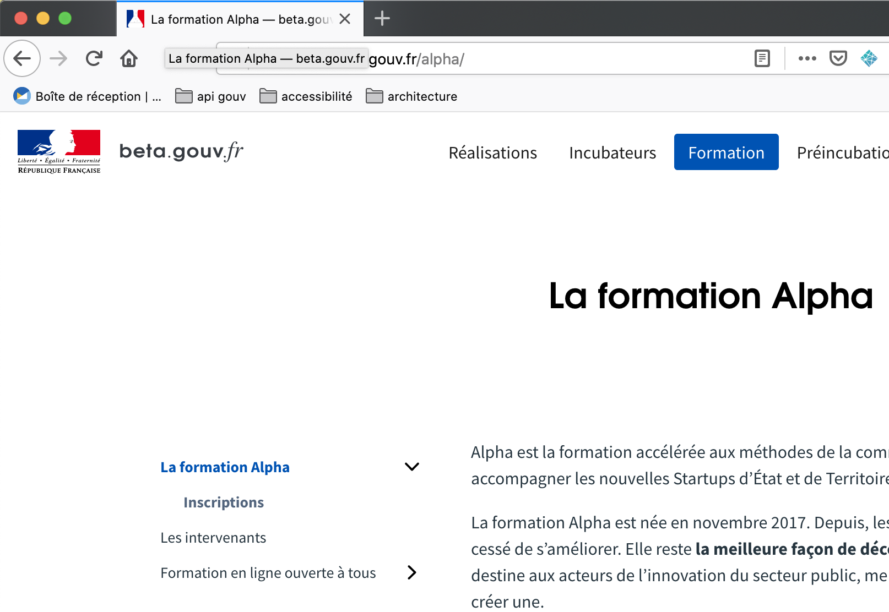
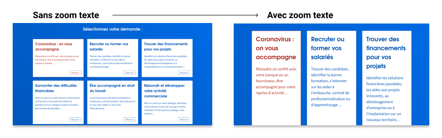

# Construction

## Identifier les rôles de chacun

Chaque membre de l'équipe peut mettre ses compétences à disposition pour améliorer l'accessibilité du service.



Les designers ont la responsabilité de concevoir un service accessible, qu'il s'agisse de wireframes, prototypes ou maquettes.

Le site [Design Accessible](https://design-accessible.fr) propose une checklist : navigation, couleurs, formulaires...



Les développeurs et développeuses ont la responsabilité de coder des composants accessibles. De nombreux outils peuvent aider :

* Le [Design System de l'État](https://www.systeme-de-design.gouv.fr/) propose une documentation et des composants nativement accessible. Le webinaire [Faire un service accessible avec le DSFR](../../design/dsfr/) peut guider sur les bonnes pratiques à appliquer.
* Les Notices d'AccedeWeb listent les règles à respecter avec des exemples : [Notice d’accessibilité HTML et CSS](https://www.accede-web.com/notices/html-et-css/) pour la structure générale, les titres, liens, boutons, formulaires, liste... ; et la [Notice d’accessibilité des principaux composants d’interface riche](https://www.accede-web.com/notices/interface-riche/) pour les composants d’interface interactifs (accordéons, modales, menu déroulant....)



De nombreuses personnes peuvent être amenés à rédiger du contenu, au sein du service d'une SE. La [Notice d’accessibilité éditoriale ](https://www.accede-web.com/notices/editoriale-modele/)d'AccedeWeb donne des règles à respecter pour créer du contenu accessible en ligne.



## S'appuyer sur du code accessible

Une partie de l'accessibilité repose sur le développement front. Pour développer du code sémantique accessible, certaines pratiques sont indispensables :&#x20;

* Avoir des compétences front, ou à minima, utiliser le design system de l'État
* Mettre en place des tests automatiques dès les premières lignes de code

## Recetter régulièrement l'accessibilité


L’accessibilité, ça ne se voit pas, ça se manipule !


Il existe quelques bonnes pratiques faciles à vérifier, pour identifier les problèmes d'accessibilité les plus évidents. Ces vérifications ne demandent aucune connaissances techniques : n'importe qui peut s'en assurer !


Formez vous grâce à l'atelier **« Vérifier l'accessibilité de mon service »** mené une à 2 fois par mois, sur [inscription](https://espace-membre.incubateur.net/formations?filter=Accessibilit%C3%A9).


En faisant ces vérifications régulièrement (à chaque nouvelle feature, à chaque sprint, etc.), votre service pourra prétendre à environ 50% de conformité.

### 10 choses faciles à vérifier

En attendant l'atelier, vous pouvez déjà faire un petit tour d'horizon de votre service pour vérifier que :



**Il y a au moins deux façons de naviguer dans le site.** Cela peut être un menu mais aussi un moteur de recherche, un plan, un fil d'ariane...

**Il est possible de naviguer au clavier**

Si la navigation au clavier est possible, les personnes utilisant des technologies d'assistances comme un lecteur d'écran pourront aussi utiliser votre service.

* Toutes les sections du site et toutes les actions sont possibles grâce au clavier (`tab` pour naviguer d'une zone à un autre, `shift + tab` pour revenir en arrière et `Entrer` pour actionner un lien).
* Un effet focus permet de repérer facilement la zone sélectionnée.
* Il est toujours possible de sortir d'une zone au clavier.




**Les titres des pages ont du sens**

La balise titre est la première chose lue par un lecteur d'écran : elle doit donc permettre à l'utilisateur de se repérer facilement :

* Elle décrit le contenu de la page brièvement.
* Plusieurs pages du même site peuvent être différenciées facilement.

**Les titres respectent un ordre hiérarchique**

Les titres de la page sont cohérents : il n'y a pas de trous dans les niveaux (de h1 à h6).


Je vérifie avec l'extension [HeadingsMap pour Firefox](https://addons.mozilla.org/fr/firefox/addon/headingsmap/)


**La taille des textes peut être agrandie**

Certains utilisateurs agrandissent le texte de la page pour mieux pouvoir le lire. Si j'utilise les options de zoom de texte du navigateur, le site doit rester lisible, les différentes informations ne doivent pas se superposer.




**Le sens n'est jamais véhiculé uniquement par un code graphique**

Beaucoup d'utilisateur ont des difficultés à percevoir les couleur ou à comprendre certains pictogrammes. On peut doubler les éléments signifiants en ajoutant un texte à l'icône par exemple.

**Tous les éléments graphiques signifiants ont une alternative textuelle**

Si un élément graphique est purement décoratif, le lecteur d'écran ne doit pas recevoir d'information : il convient de laisser l'image sans alternative.\
Lorsqu'un élément graphique porte un sens, il faut lui donner une alternative textuelle.


Les tests automatiques afficheront une erreur si vous ne décrivez pas une image. Ne vous fiez pas toujours à ces tests : vous seuls savez si l'image porte un sens ou non.




**Le formulaire est accessible du début à la fin.**

Les champs obligatoires sont clairement identifiés.

L'autocomplétion n'est pas bloquante.

Il n'y a pas de captcha ou d'élément graphique infranchissable pour valider le formulaire.



**Les contrastes sont suffisants.**

Le ratio de contraste entre la couleur de fond et la couleur du texte est supérieur à 4,5.

Les niveaux de contrastes peuvent être testés grâce l'onglet "accessibilité" de l'inspecteur de votre navigateur.


Pour trouver les couleurs accessibles les plus proches de votre charte graphique, vous pouvez utiliser les suggestions de [Contrast Finder](https://contrast-finder.tanaguru.com/?lang=fr), de Tanaguru


**Le site reste lisible et compréhensible lorsque la feuille de style css est désactivée**

Dans votre navigateur, vous pouvez désactiver la feuille de style appliquée à votre service : le site reste-t-il lisible ?



### Pour aller plus loin

* Utiliser des outils dédiés :



Ces outils peuvent s'installer d'un simple `drag 'n drop` vers la barre des signets de votre navigateur. Ils sont donc compatibles tout navigateurs :

* [**ANDI**](https://www.ssa.gov/accessibility/andi/help/install.html) : détecte automatiquement plusieurs types de problèmes d'accessibilités et donne des conseils pratiques pour les corriger.



* [**Assistant RGAA**](https://chrome.google.com/webstore/detail/assistant-rgaa/cgpmofepeeiaaljkcclfldhaalfpcand?hl=fr) **:** extension de navigateur pour auditer des pages web en suivant le référentiel RGAA (attention, il s'agit du RGAA 3.0)
* [**WAVE**](https://wave.webaim.org/extension/) **:** détecte automatiquement plusieurs types de problèmes d'accessibilités et donne des conseils pratiques pour les corriger.



* [**WAVE**](https://wave.webaim.org/extension/) **:** détecte automatiquement plusieurs types de problèmes d'accessibilités et donne des conseils pratiques pour les corriger.
* [WCAG Constrast Checker](https://addons.mozilla.org/en-US/firefox/addon/wcag-contrast-checker/) : vérifie les contrates sur la page



* [**WAVE**](https://wave.webaim.org) **:** détecte automatiquement plusieurs types de problèmes d'accessibilités et donne des conseils pratiques pour les corriger.



## **Mettre en place des tests automatiques**

Les outils de tests automatiques permettent de tester environ 30 % des critères du RGAA. Ils ne sont donc pas exhaustifs mais restent indispensables dans une démarche de qualité continue. Ils permettent de :

* mesurer l'accessibilité de votre service ;
* identifier les problèmes d'accessibilité et les régressions.

Voici quelques outils que l'équipe de développement peut mettre en place sur votre service :

* [Dashlord](https://doc.incubateur.net/communaute/travailler-a-beta-gouv/jutilise-les-outils-de-la-communaute/dashlord) : le tableau de bord de la communauté pour mesurer la qualité de son service (accessibilité, mais aussi sécurité, RGPD...) permet de lancer des tests automatiques (au moins sur la page d'accueil)
* [axe-core](https://github.com/dequelabs/axe-core) : un moteur de tests d'accessibilité automatique
* [asqatasun](https://hub.docker.com/r/asqatasun/asqatasun/) : un outil open-source et français d'analyse d'accessibilité et SEO.


Documentation plus complète sur les tests automatiques à venir.


## Mettre en place des tests automatisés

Les tests _automatisés_ permettent de tester l'accessibilité, via des scénarios écrits manuellement, de manière automatique. Ils permettent d'aller un peu plus loin que les tests automatiques.

Tanaguru permet de faire des [audits automatisés](https://my.tanaguru.com/home/contract/audit-page-set-up.html?cr=943) gratuitement.


Documentation plus complète sur les tests automatiques à venir.


### Checklist de la phase Construction

* [ ] Nous sommes en règle sur l'aspect légal.
* [ ] Notre produit s’appuie sur une base HTML saine (DSFR, dev front qualifié…).
* [ ] Nous avons mis en place des tests automatiques d'accessibilité.
* [ ] Nous recettons régulièrement l'accessibilité pour limiter la dette.
