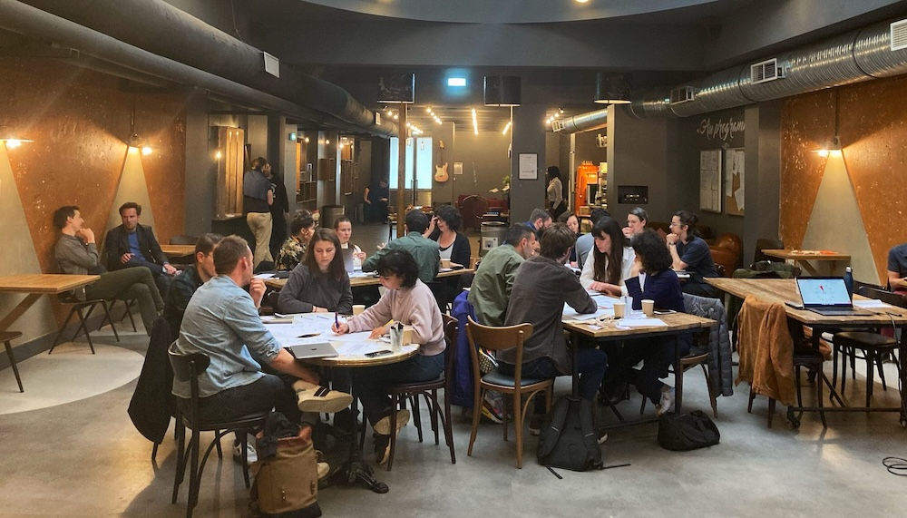
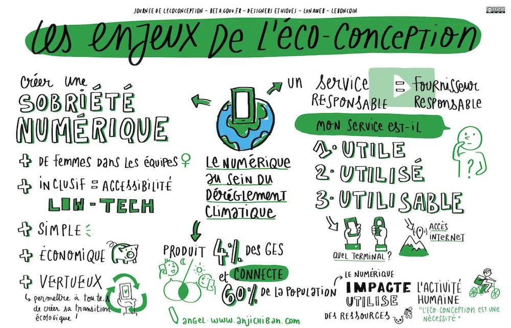
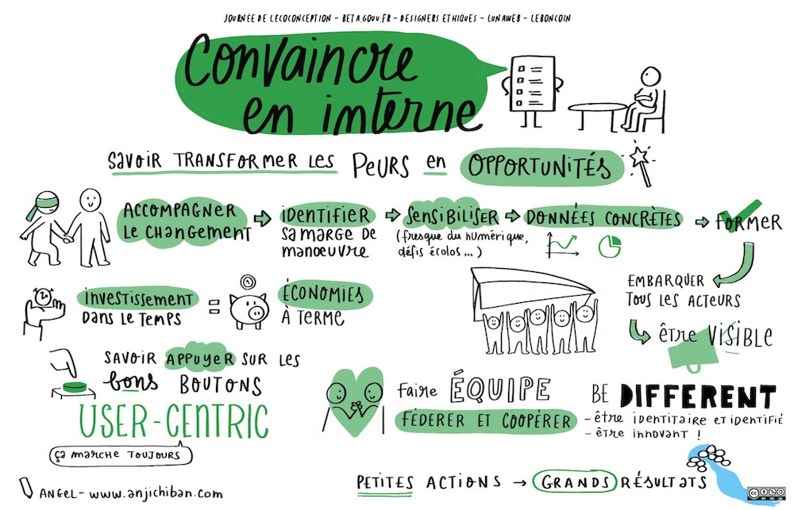

# Retour sur la Journée de l'Écoconception

Jeudi 5 mai 2022, les designers de [beta.gouv.fr](http://beta.gouv.fr) ont organisé une **Journée de l'Écoconception** en partenariat avec les Designers Éthiques, l'agence Lunaweb et l'entreprise privée Leboncoin.

Le temps d'une journée, nous avons rassemblé une quinzaine d'intervenant·es et plus de 100 invités, professionnels du numérique, privé ou public autour des mêmes enjeux : comment limiter l'impact du numérique sur la planète. **La journée fut riche en échanges et en partages d'expériences : conférences, ateliers, fresques du numérique...** En voici le résumé en images :

## Les enjeux de l'éco-conception

Le numérique est au cœur du dérèglement climatique. Il produit 4 % des gaz à effets de serre, mais il **connecte 60 % de la population mondiale** ! Par ailleurs, le numérique a un impact sur les ressources, mais aussi sur l'activité humaine.

Créer un service responsable, via un fournisseur responsable est donc capital pour créer une sobriété numérique. On peut se poser ces questions :

* Mon service est il **utile** ?
* Mon service est-il **utilisé** ?
* Mon service est-il **utilisable** ? (sur tout type de terminal, même avec un accès internet réduit)

Créer une sobriété numérique passe par plusieurs leviers :

* **Plus de femmes** dans les équipes
* Des services **inclusifs** et **accessibles**
* Des services **simples**
* Un **modèle économique viable**
* Un produit **vertueux**, pour permettre à tout.te.s de créer sa transition écologique.

## Les bonnes pratiques

La première question à se poser est : **Quel impact à mon service ?** Faire un **audit** sur l’arborescence, les textes, la nomenclatures, les médias ou les technos utilisées permet de **se situer**.

En éco-conception, le mot d’ordre est **frugalité** :

* limiter le poids des médias
* limiter des notifications (tout le monde n’a pas la 5G !)
* choisir des technologies légères et pérennes
* se souvenir que le smartphone est un ordinateur
* se concentrer sur les fonctionnalités essentielles.

**Less is more. Simple is smart.** En d'autres termes, de quoi a-t-on besoin ?

* Simplifier le parcours utilisateur
* Économiser l’attention
* Gagner en espace mental

mais être obligé de faire des choix.

Et surtout se souvenir que les **contraintes libèrent la créativité**. On peut :

* limiter le nombres de typos
* favoriser le texte aux images aux vidéos (et stop à l’autoplay !)

## **Comment convaincre en interne ?**

L’enjeu est de **savoir transformer les peurs en opportunités** :

* **Accompagner le changement**
* **Identifier** sa marche de manœuvre
* **Sensibiliser** (via des fresques du numérique, des défis écos…)
* Mesurer des **données concrètes**
* (Se) **former**
* **Embarquer** tous les acteurs
* et surtout **être visibles** !

L’éco-conception est un **investissement** dans le temps. À terme, on fait donc des **économies**.

Pour convaincre, “appuyer sur les bons boutons” est nécessaire. Avoir une **démarche centrée usager**, ça marche toujours !

Faire équipe, **fédérer et coopérer** sont des moteurs puissants.

Enfin, l’éco-conception permet aussi de **se différencier** : d’être identifié et innovant.

N’oublions pas que les petites actions mènent à de grands résultats !
