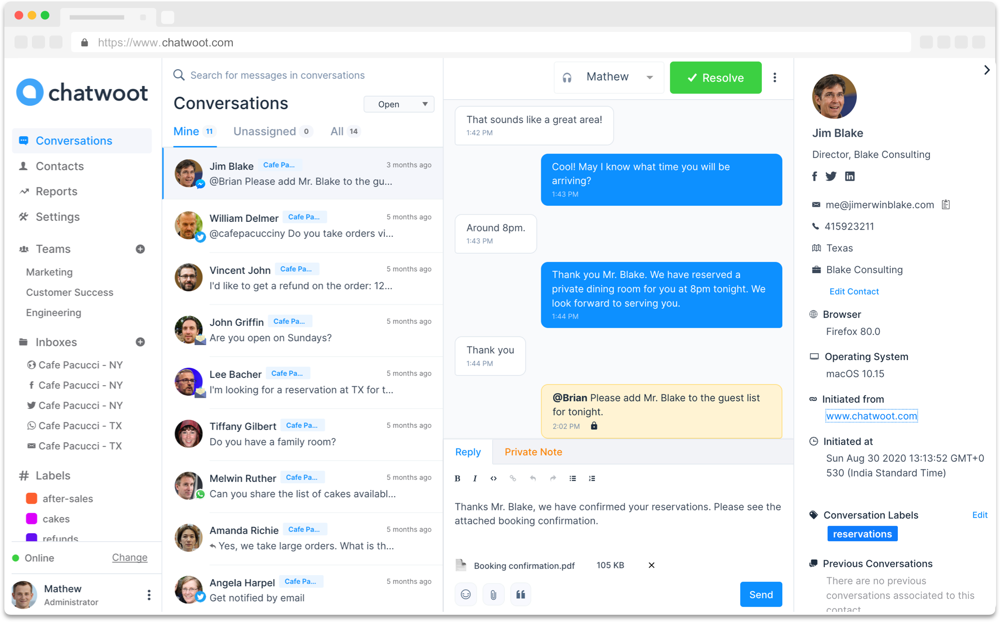

# No code

Si tu as besoin de conseil pour choisir et prendre en main les bons outils no-code, tu peux solliciter de l'aide sur \#domaine-growth

Les outils no code permettent de développer un MVP utilisable en production sans coder, ou de proposer des fonctionnalités supplémentaires à son outil sans coder pendant des semaines.

### Veille tooling de Chaïb

Pas facile de trouver le bon outil pour sa startup d'état. Voici un petit tours des outils qui peuvent vous rendre bien des services. 

#### Avril 2021

Au programme : 

#### Chatwoot

* [https://www.chatwoot.com](https://www.chatwoot.com) : Crisp/Intercom/Front open source .
* Chat et email partagé 
* En prod via Maxime Dréau pour ANAIS . Julien veut faire un POC sur scalingo.  Test en cours

#### Plausible

* [https://plausible.io/](https://plausible.io/) : Matomo en plus simple et plus beau. Open sournce. Prix ridicule . 100% data ownership. 100% RGPD \(pas de bandeau\). Utilisé sur mesconseilscovid.sante.gouv.fr

#### Integromat

* [https://www.integromat.com/en](https://www.integromat.com/en) : Zapier 5x moins chers . Test en cours
* Automatisation de tache

#### Verifaute

* [https://verifaute.fr/](https://verifaute.fr/) : Ce n'est pas un SaaS mais une société de correcteur/relecteur "as a service". Parfait si vous êtes nul comme moi en orthographe :\) 

### L'automatisation facile avec [Zapier](https://zapier.com)



Durée : 1h30, par Chaïb Martinez

[Voir la vidéo sur Youtube](https://youtu.be/PsbHrkS3fC0)

L’objectif de cet atelier est que vous puissiez automatiser un maximum de chose à la fin de l’atelier, et vous faire gagner du temps au quotidien dès le lendemain. Que vous soyez Bizdev, Intra, Coach, ou Dev.

Comment? En faisant communiquer entre elles vos applications préférées, votre produit, etc , tout ça sans une ligne de code

Exemple en commentaire de choses que vous pouvez faire avec Zapier si vous êtes Bizdev, Intra, ou Dev :

Exemple \(Bizdev\): Quand une administration rempli un formulaire d’inscription sur mon site =&gt; créer une fiche prospect dans votre CRM =&gt; envoyer une notification sur Slack =&gt; envoyer un email de bienvenue a l’administration =&gt; inscrire le prospect sur notre newsletter

Exemple \(Produit\): Quand une carte arrive dans la colonne, « en prod » sur le trello Produit =&gt; envoie une notif sur slack =&gt; ajouter le contenu de la carte dans le Google Doc « Newsletter produit »

Exemple \(Dev\): Quand une nouvelle erreur 500 apparait sur Sentry =&gt; si elle contient telle chaine =&gt; envoyer un motif sur slack =&gt; envoyer un SMS a Thomas

Exemple \(Dev\): Quand il se passe ça sur le produit =&gt; appeler tel wehbook sur Zapier =&gt; \[Le bizdev fait ce qu’il veut ensuite avec l'info\]

