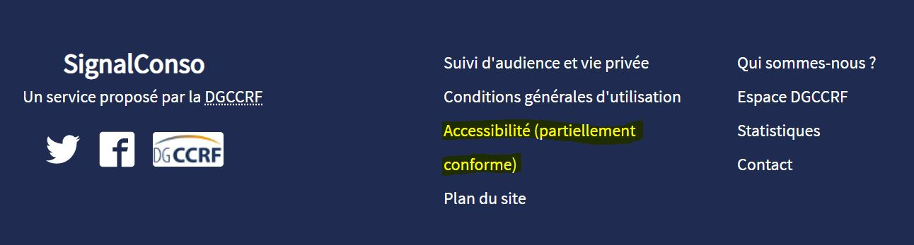

# Acces

## Accompagner une démarche d'accessibilité

Le programme Access est destiné aux Startups d'États du réseau beta.gouv.fr pour :

* **connaître ses** **obligations légales** d'accessibilité
* **corriger les erreurs d'accessibilité** les plus fréquentes 
* **passer un audit** d'accessibilité
* **être en conformité** partielle ou totale.

Ce programme est une expérimentation au sein de beta.gouv.fr depuis mars 2021.

## Un programme qui répond à des enjeux légaux

En 2020, une étude menée par les Designers Transverses auprès de toutes les SE de l'incubateur a montré qu'**une seule équipe respectait ses obligations légales**. C'est peu 😭. Au niveau national, c'est seulement un peu mieux : seulement [10 % des services publics sont accessibles](https://observatoire.numerique.gouv.fr/).

Pour 2021, l'objectif de beta.gouv.fr est que **100 % des SE en accélération et transfert respectent les obligations légales.** En particulier l'obligation d'afficher le « niveau de conformité  RGAA \(Référentiel Général d'Accessibilité pour les Administrations\) » sur la page d'accueil du site.

## Prérequis pour intégrer ce programme

* Avoir un produit en accélération ou en phase de transfert.
* Avoir étudié les [10 choses faciles à vérifier pour un site plus accessible](https://doc.incubateur.net/design/nos-rendez-vous-design/formation/accessibilite/10-choses-faciles-a-verifier-pour-un-site-plus-accessible).
* Disposer de ressources en développement et design.


Découvrir le[ Kit d'accessibilité](https://doc.incubateur.net/design/ressources-design/kit-accessibilite).


## Déroulé du programme Access

| Étapes | Délais | Durées |
| :--- | :--- | :--- |
| [ 1. Inscription](https://airtable.com/shrcbylpZ2GCOsK8q) | Jour 1 |  |
| 2. Présentation du programme | Jour 7 | ~60 minutes |
| 3. Audit Flash | Jour 15 |  |
| 4. Implémentation des premières mesures à faible coût |  |  |
| 5. Audit approfondi par un cabinet spécialisé | ~Jour 30 |  |
| 6. Accompagnement du cabinet pour atteindre l'objectif |  | 30 jours |
| 7. Évaluation du programme | ~Jour 60 | ~60 minutes |


Ce programme peut être entièrement financé par beta.gouv.fr pour les Startups d'État en phase d'accélération ou en cours de transfert. L'étape 5 \(audit approfondi par un cabinet\) peut être financée par la DINUM si l'équipe ne dispose pas des ressources nécessaires \(5000€ en moyenne\). Certains incubateurs souhaitent également le financer eux-mêmes.


### Inscription

Tous les 2 ou 3 mois, nous lançons une nouvelle promotion Access. Le lien d'inscription est renseigné sur le Slack de Beta ou dans l'infolettre interne de beta.



### Présentation du programme

L'équipe reçoit un mail pour fixer la date d'entretien avec l'équipe en charge d'Access. Cet entretien durera environ 60 minutes par téléphone ou en visio. 


Pour préparer au mieux son oral, l'équipe peut consulter le [Kit accessibilité](https://doc.incubateur.net/design/ressources-design/kit-accessibilite).


### Audit Flash

Un ou une designer de l'équipe transverse réalise un ⚡**Audit flash d'accessibilité** du produit. Cet audit se fait sur une portion réduite du produit, et sur quelques critères seulement. Il vise à « prendre la température ».

L'équipe reçoit alors un rapport contenant :

* la liste des points conformes : les éléments conforme du site 🎉
* la liste des éléments à corriger, avec des recommandations et/ou sites à prendre en exemple.

### Implémentation des premières mesures

Sur la base des conclusions de l'audit flash, l'équipe de la SE devra implanter les recommandations. Les critères audités par l'audit flash ⚡sont des éléments ayant **un impact fort sur l'accessibilité**, et relativement faciles à corriger.

### Audit de conformité par un cabinet spécialisé

L'équipe est prête à confronter son site auprès d'un cabinet spécialisé pour une **prestation d'audit et d'accompagnement** qui contient :

* un audit de conformité RGAA \(pour obtenir le score et le taux de conformité\)
* des recommandations pour améliorer ce score

### Accompagnement du cabinet pour atteindre l'objectif

L'équipe de la SE et le cabinet travailleront ensemble pour obtenir le score _« Partiellement conforme »_ ou _« Totalement conforme »_.

### Évaluation du programme

Une rétrospective avec l'équipe de la SE permettra d'évaluer les apprentissages et les points à améliorer vis-à-vis de ce programme Access.


Vous pouvez poser toutes vos question sur [le salon dédié](https://mattermost.incubateur.net/betagouv/channels/c015lnmttj9) ou à designer@beta.gouv.fr .


