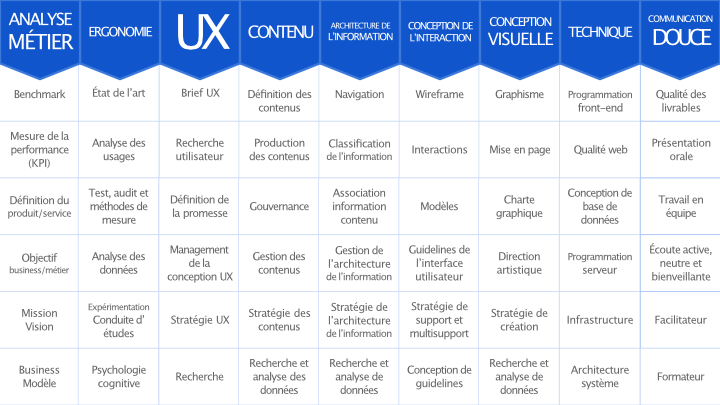

# Recruter un designer

Le métier d'UX designer regroupe un large panel de compétences dans différents domaines : ergonomie, conception de l'intéraction, conception visuelle, communication douce... et pour lesquelles chaque designer peut être plus ou moins spécialisé.

Pour mieux comprendre de quel type de designer votre produit a besoin, vous pouvez par exemple proposer à vos candidats de remplir un **modèle de compétences** comme le modèle en T.


Plus d'informations sur [les compétences UX et le modèle en T](https://blocnotes.iergo.fr/articles/competences-ux-et-modele-en-t/)


## Les temps forts du design

Par ailleurs, selon la phase du projet, un UX designer n'interviendra pas de la même manière, ni pour répondre aux mêmes objectifs.


Plus de détails dans [Comprendre le rôle du design](https://app.gitbook.com/@beta-gouv/s/guide-se/design-et-experience-utilisateur/comprendre-le-role-du-design)


