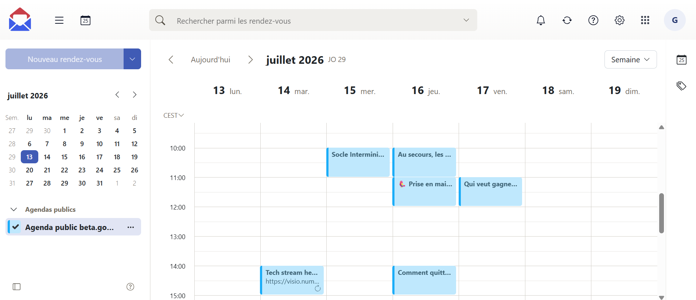

# 📅 Agenda de la communauté

Les évènements de la communauté beta.gouv.fr sont référencés sur un [agenda public](http://messagerie.numerique.gouv.fr/appsuite/api/share/0366722a002da2b9366722802da84e5eb694970c9c989a65/1/2/Y2FsOi8vMC8yMjczNA). Il est visible par tout le monde et peut être ajouté à ton propre gestionnaire d'agenda.


Pour ajouter un évènement à l'agenda de la communauté, contacte l'équipe animation sur [Tchap BetaGouv-entraide-communaute](https://tchap.gouv.fr/#/room/!FznvyqtGVRlsGHcLVE:agent.dinum.tchap.gouv.fr?via=agent.dinum.tchap.gouv.fr).

