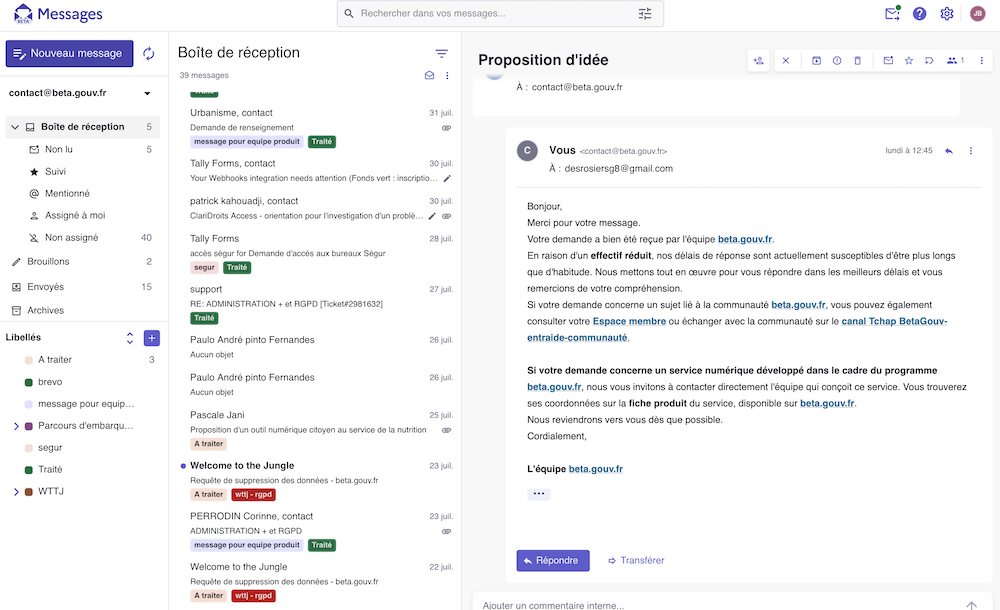

# Messages

L’équipe animation met à votre disposition une instance de [Messages](https://messages.suite.anct.gouv.fr) qui permet de **gérer des boites emails à plusieurs, typiquement pour traiter du support**. (Cet outil peut également être déployé indépendamment par votre équipe si besoin.)

#### Fonctionnalités: 

* gestion multi-utilisateurs
* réponses automatiques
* modèles de messages
* commentaires sur les messages
* API
* ...


Documentation utilisateur : [https://aide.suite.anct.gouv.fr/socle/messages](https://aide.suite.anct.gouv.fr/socle/messages)


<figure><figcaption></figcaption></figure>

#### L'utiliser

Vous pouvez au choix :

* demander une adresse email en `[equipe]@support.incubateur.net` pour tester rapidement
* rediriger un de vos emails existants sur cette instance
* gérer vous-mêmes vos adresses en connectant votre sous-domaine dédié, ex `support@[equipe].beta.gouv.fr`

L'instance est dispo sur https://support.incubateur.net

Demandez votre accès via le [canal Tchap beta.gouv.Fr/Demandes-OPS](https://tchap.gouv.fr/#/room/!VxFWdbcSlumKPvpVRP:agent.dinum.tchap.gouv.fr?via=agent.dinum.tchap.gouv.fr\&via=agent.culture.tchap.gouv.fr\&via=agent.finances.tchap.gouv.fr)
