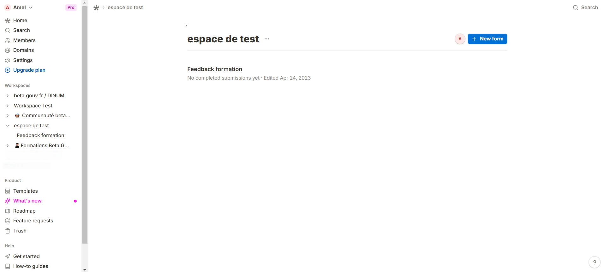

# Tally

​[Tally ](https://tally.so/)est un outil qui permet la création de formulaires et de sondages en ligne. Son utilisation est simple et peut s'adapter à toutes vos envies. \
\
Nous avons pris une licence afin de la partager avec les startups d'Etat souhaitant l'utiliser. Nous créons des espaces de travail pour chaque startup.Comment

## Comment demander son accès à Tally ? 

Rien de plus simple ! Envoie un mail à animation@beta.gouv.fr en précisant le nom de ta startup d'Etat afin de demander un accès. \
Si ta startup a déjà un compte, tu pourras te faire inviter pas un membre ayant déjà un accès.


Pour des raisons de sécurité, une règle est à respecter : Seuls les mails d'agents publics ou les mails beta.gouv.fr sont autorisés à rejoindre les espaces de travail. Chaque compte ajouté ne respectant pas cette règle sera supprimé.


<figure><figcaption></figcaption></figure>
