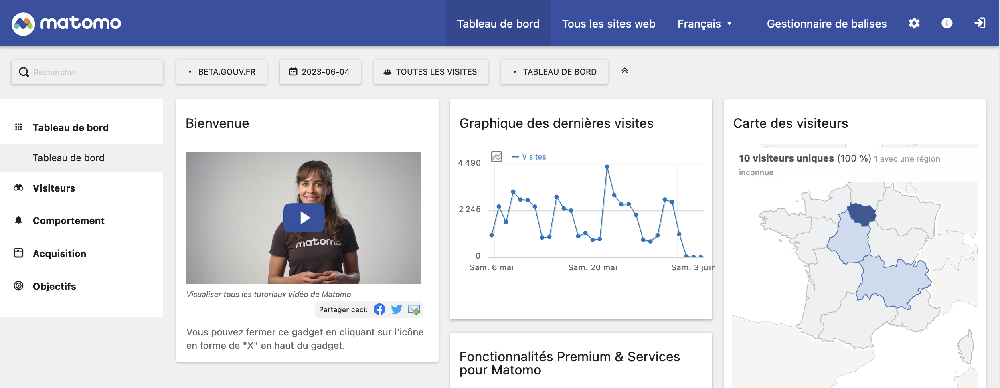

# Matomo

 

## C'est quoi en quelques mots?

Matomo est un logiciel d'analyse de sites web qui permet de collecter, suivre et analyser les données relatives aux visiteurs et à leur comportement sur un site web. Il s'agit d'une alternative open source à des solutions commerciales telles que Google Analytics.

Matomo propose des fonctionnalités telles que le suivi des pages vues, des clics, des téléchargements, des objectifs de conversion, des événements personnalisés, etc. Il permet également de mesurer l'efficacité des campagnes marketing, de suivre les performances des mots-clés et des pages spécifiques, et de générer des rapports détaillés sur l'activité du site.

Pour consulter les statistiques de trafic des sites en `*.beta.gouv.fr` : [stats.beta.gouv.fr](https://stats.beta.gouv.fr/index.php?module=MultiSites\&action=index\&idSite=1\&period=day\&date=yesterday).

C'est un outil en ligne géré par beta.gouv.

Plus d'infos sur le site officiel : [https://matomo.org](https://matomo.org)

Des [plugins matomo premium](https://plugins.matomo.org/premium) peuvent être installés à la demande, n'hésitez pas à nous solliciter si besoin d'en ajouter ou configuration particulière : Pour en discuter, rdv dans [le canal de discussion dédié à Matomo](https://mattermost.incubateur.net/betagouv/channels/incubateur-matomo)


Canal de discussion dédié à Matomo sur mattermost : incubateur-matomo


## Matomo, comment ça marche ?

Matomo est l'équivalent _open source_ de Google Analytics.

<table data-card-size="large" data-view="cards"><thead><tr><th></th><th></th><th></th><th data-hidden data-card-target data-type="content-ref"></th></tr></thead><tbody><tr><td></td><td><a href="https://ronan-hello.fr/series/matomo"><strong>Consulte ce site si tu souhaites accéder à plusieurs modules de formation pour apprendre les bases de l'outil</strong></a></td><td></td><td><a href="https://ronan-hello.fr/series/matomo">https://ronan-hello.fr/series/matomo</a></td></tr></tbody></table>

## Ajouter un site en beta.gouv.fr au Matomo mutualisé

Vous pouvez faire la demande via l'espace-membre : https://espace-membre.incubateur.net/services/matomo

## Recommandations pour utiliser Matomo sans bannière de consentement aux cookies

Les sources d'information de référence s'accordent à dire que la bannière de consentement est optionnelle dès lors que les critères suivants sont respectés :

1. permettre aux visiteurs de refuser d’être suivis (Opt-out) ([exemple](https://developer.matomo.org/guides/tracking-javascript-guide#optional-creating-a-custom-opt-out-form))
2. désactiver les cookies (par le biais de [disableCookies](https://fr.matomo.org/faq/general/faq\_157/#disable-cookies-for-a-specific-site-when-you-are-using-matomo-on-premise-or-matomo-cloud) ou [via l'admin de Matomo](https://fr.matomo.org/faq/general/faq\_157/#if-you-are-using-matomo-tag-manager))
3. anonymiser les IP : anonymiser au moins 2 octets [via l’admin de Matomo](https://matomo.org/faq/general/configure-privacy-settings-in-matomo/)
4. anonymiser le référent via [l’admin de Matomo](https://fr.matomo.org/faq/how-to/how-do-i-anonymize-the-referrer-information/)
5. exclure les données personnelles des URL et titre des pages
6. _exclure les données personnelles des variables personnalisées, dimensions, évènements (usage avancé)_
7. _masquer les données personnelles dans les heatmaps et les enregistrements d’écran (usage avancé)_
8. _exclure les identifiants de commande de commerce électronique (usage avancé)_
9. ne pas activer les fonctions user-id
10. utiliser uniquement les données à des fins d’analyse (pas de croisement de données)
11. ne suivre les utilisateurs que sur un seul site ou une seule application
    1. vérifier que la fonctionnalité de “[cross domain tracking](https://matomo.org/faq/how-to/faq\_23654/)” n’est pas utilisée sur les domaines, c’est à dire qu’on ne puisse pas repérer un utilisateur sur 2 domaines différents
    2. vérifier que la fonctionnalité de “[cookies tiers](https://matomo.org/faq/how-to/faq\_118/)” n’est pas activée.
12. mécanisme de consentement négatif - (NDA : simple recommandation car cela donnerait très peu d'informations en l'appliquant strictement)
13. publier une politique de confidentialité à jour

_Références_

* [Comment configurer Matomo pour une protection de la vie privée sans consentement](https://fr.matomo.org/faq/how-do-i-use-matomo-analytics-without-consent-or-cookie-banner/#comment-configurer-matomo-pour-une-protection-de-la-vie-privee-sans-consentement)
* [CNIL: Exemption du recueil de consentement •Mesure d’audience • Guide de configuration Matomo Analytics](https://www.cnil.fr/sites/cnil/files/atoms/files/matomo\_analytics\_-\_exemption\_-\_guide\_de\_configuration.pdf)

Une fois votre compte créé sur Matomo, vous pouvez installer le tracker sur votre site web


Si vous activez des fonctionnalités telles que les "heatmaps" vous devez obligatoirement demander le consentement de l'utilisateur.


## Installation

Vous pouvez utiliser le tracker officiel Matomo ou un SDK adapté type [vue-matomo](https://www.npmjs.com/package/vue-matomo), [matomo-tracker-react](https://www.npmjs.com/package/@datapunt/matomo-tracker-react) ou [matomo-next](https://www.npmjs.com/package/@socialgouv/matomo-next).

La documentation officielle du tracker Matomo est disponible sur [https://developer.matomo.org/guides/tracking-javascript-guide](https://developer.matomo.org/guides/tracking-javascript-guide).

## Recommandations


Sécurité : N'envoyez jamais de données personnelles dans Matomo.


| Type         | Description                                                                                                                                                                                                                                                                                                                                                                                                           |
| ------------ | --------------------------------------------------------------------------------------------------------------------------------------------------------------------------------------------------------------------------------------------------------------------------------------------------------------------------------------------------------------------------------------------------------------------- |
| RGPD         | [J'exclus les champs sensibles du tracking Matomo](https://matomo.org/faq/heatmap-session-recording/faq\_24214/)                                                                                                                                                                                                                                                                                                      |
| RGPD         | Je n'utilise pas de données personnelles dans des éléments potentiellement enregistrés (tels l'url et le titre d'une page)                                                                                                                                                                                                                                                                                            |
| Legal        | La politique de confidentialité mentionne la collecte des informations de tracking et [propose un opt-out](https://fr.matomo.org/faq/general/faq\_20000/). Cela peut se faire facilement via [l'insertion d'un iframe par exemple](https://github.com/SocialGouv/code-du-travail-numerique/blob/68974a92bb034317eaa5b29454040ebe83770b19/packages/code-du-travail-frontend/pages/politique-confidentialite.tsx#L203). |
| Legal        | J'ai suivi le [guide d'exemption de bandeau cookie de la CNIL](https://www.cnil.fr/sites/cnil/files/atoms/files/matomo\_analytics\_-\_exemption\_-\_guide\_de\_configuration.pdf)                                                                                                                                                                                                                                     |
| Transparence | Je rends mes statistiques Matomo publiques                                                                                                                                                                                                                                                                                                                                                                            |
