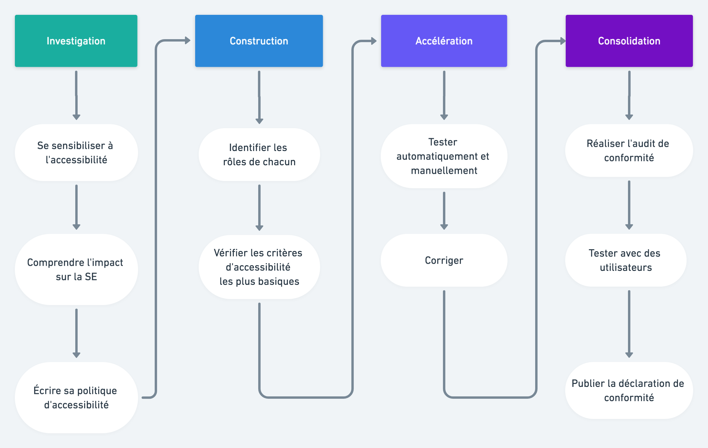

# Le Kit de l'accessibilité

**L’accessibilité est une démarche sur le long terme** : elle se pense dès l'investigation du service, elle est régulièrement évaluée pendant la construction puis tout au long de la durée d’exploitation du service.

La conformité ne s'atteint pas en un jour et ça n'est pas grave : c'est **l'engagement vers la démarche qui est important** !


[investigation.md](investigation.md)



[construction.md](construction.md)



[acceleration.md](acceleration.md)



[consolidation.md](consolidation.md)

