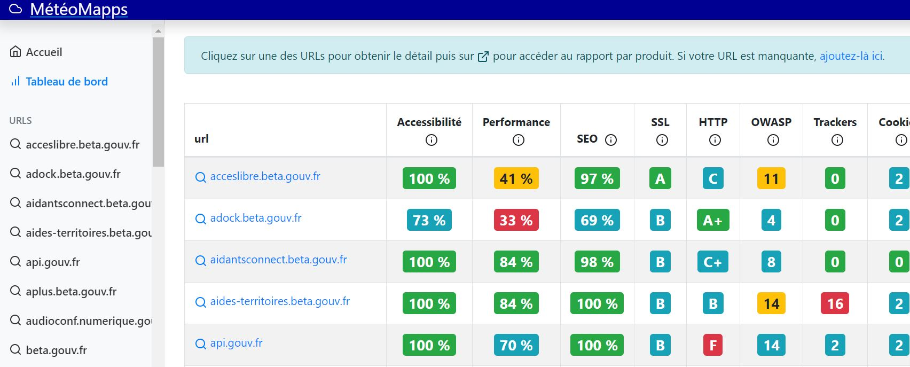

# DashLord


**Un DashLord, c'est quoi ?**

Un dashLord est un tableau de bord. Il permet de situer sa Startup d'État ou de Territoires par rapport aux standards du marché : accessibilité, sécurité et RGPD.


## Les tableaux de bords de la communauté

| Incubateur | URL |
| :--- | :--- |
| DINUM | [https://dashlord.incubateur.net/](https://dashlord.incubateur.net/#/) |
| Fabrique de ministères sociaux | [https://socialgouv.github.io/dashlord-fabrique](https://socialgouv.github.io/dashlord-fabrique) |
| Fabrique numérique du MTES | [https://mtes-mct.github.io/dashlord/\#/dashboard](https://mtes-mct.github.io/dashlord/#/dashboard) |

## Pour qui ?

### Les intrapreneurs

* **Pour rassurer sa DSI** sur la qualité du code et la conformité du produit.

### Les équipes techniques

* **Pour évaluer la qualité du code** : accessibilité, RGPD, sécurité...

### Les équipes d'animation d'incubateurs ou de fabriques :

* **Pour identifier quelles équipes ont le plus de besoins** et où mettre son énergie.
* **Pour avoir une vision technique d'ensemble** du pool de Startups d'État.

### Les membres des équipes

* Pour gagner du temps

## Stratégie de déploiement

### Construire une communauté de membres


**Rejoindre le canal de discussion :** [**\#incubateur-dashlord**](https://startups-detat.slack.com/archives/C01SDQX0DB5)\*\*\*\*


### S'appuyer de travaux existants

Julien, de la Fabrique du Mass, a engagé des travaux pour :

* sécuriser les fonctionnalités déjà développées afin de fiabiliser les indicateurs disponibles ;
* disposer d'un système pour connaître la stack technique des équipes afin de permettre de leur adresser les alertes de sécurité de l'ANSSI quand elles les concernent.

### Critères de succès

D'ici la fin de l'année 2021, nous souhaitons :

* Recruter 4 startups pour expérimenter ce dispositif ;
* Connaître la stack technique de ces 4 équipes.
* Permettre à ces équipes de mettre à jour leur stack technique suite à une alerte de sécurité.

## En savoir plus



