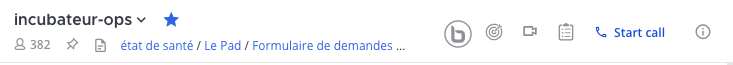
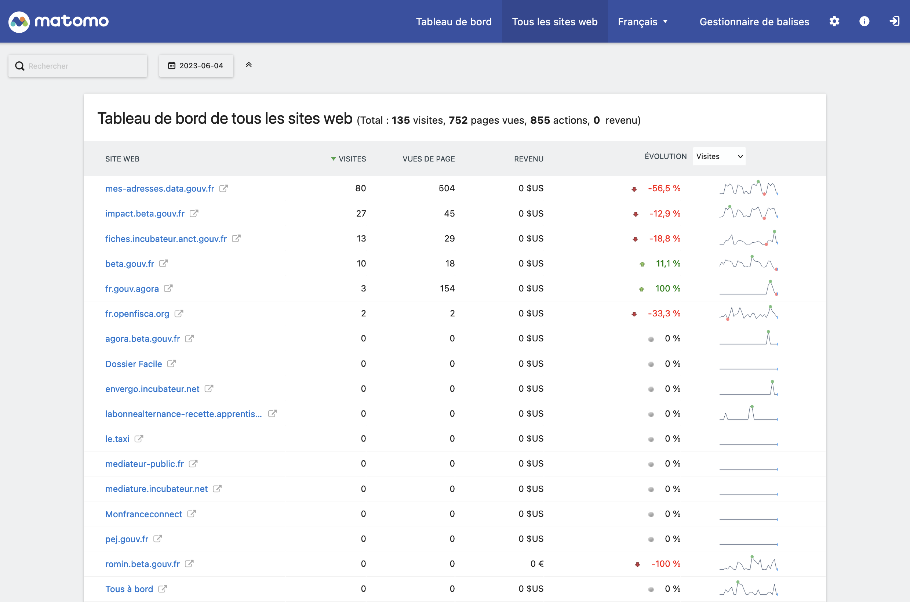
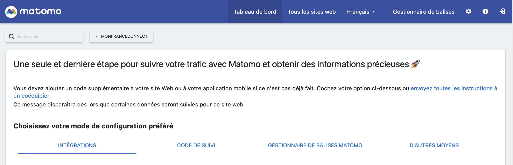

# Matomo - Analytics

_**En cours de rédaction**_

## C'est quoi en quelques mots?

Matomo est un logiciel d'analyse de sites web qui permet de collecter, suivre et analyser les données relatives aux visiteurs et à leur comportement sur un site web. Il s'agit d'une alternative open source à des solutions commerciales telles que Google Analytics.

Matomo propose des fonctionnalités telles que le suivi des pages vues, des clics, des téléchargements, des objectifs de conversion, des événements personnalisés, etc. Il permet également de mesurer l'efficacité des campagnes marketing, de suivre les performances des mots-clés et des pages spécifiques, et de générer des rapports détaillés sur l'activité du site.

Pour consulter les statistiques de trafic des sites en `*.beta.gouv.fr` : [stats.beta.gouv.fr/](https://stats.beta.gouv.fr/index.php?module=MultiSites\&action=index\&idSite=1\&period=day\&date=yesterday).

C'est un outil en ligne géré par beta.gouv.


Plus d'infos sur le site officiel : https://matomo.org/

## Matomo, comment ça marche ?

Matomo est l'équivalent _open source_ de Google Analytics.

<table data-view="cards"><thead><tr><th></th><th></th><th></th><th data-hidden data-card-target data-type="content-ref"></th></tr></thead><tbody><tr><td></td><td><a href="https://ronan-hello.fr/series/matomo"><strong>Consulte ce site si tu souhaites accéder à plusieurs modules de formation pour apprendre les bases de l'outil</strong></a></td><td></td><td><a href="https://ronan-hello.fr/series/matomo">https://ronan-hello.fr/series/matomo</a></td></tr></tbody></table>

## Ajouter un site en beta.gouv.fr au Matomo mutualisé

#### Aller dans le channel Mattermost `incubateur-ops`



Lien direct vers le channel Mattermost [ici](https://mattermost.incubateur.net/betagouv/channels/incubateur-ops)

#### Accéder au formulaire de demande

Au niveau du titre du channel il y a un lien vers un [formulaire Airtable](https://airtable.com/shrJydj6dtrdSGmfq) ainsi que le mot de passe pour y accéder.

#### Remplir le formulaire

Le formulaire devrait ressembler à ceci :


#### Vérifier que votre site est bien ajouté à Matomo

Lorsque votre site est ajouté au Matomo mutualisé de beta.gouv il doit apparaître dans la liste des sites web.

Un identifiant est associé à votre site et vous permettra par la suite d'envoyer des requêtes au serveur Matomo.



#### Configurer votre application pour Matomo

Si vous choisissez votre site dans la liste déroulante vous devriez voir apparaître cette page :



Cette page contient dans l'onglet "CODE DE SUIVI" le script qu'il vous faudra intégrer dans votre site afin de suivre l'activité des utilisateurs.

```html
<!-- Matomo -->
<script>
  var _paq = window._paq = window._paq || [];
  /* tracker methods like "setCustomDimension" should be called before "trackPageView" */
  _paq.push(['trackPageView']);
  _paq.push(['enableLinkTracking']);
  (function() {
    var u="https://stats.beta.gouv.fr/";
    _paq.push(['setTrackerUrl', u+'matomo.php']);
    _paq.push(['setSiteId', 'XXX']);              // <--- changer avec l'ID Matomo de votre site
    var d=document, g=d.createElement('script'), s=d.getElementsByTagName('script')[0];
    g.async=true; g.src=u+'matomo.js'; s.parentNode.insertBefore(g,s);
  })();
</script>
<!-- End Matomo Code -->

```

## Quelques conseils pour l'utiliser ?

Plus d'infos dans la documentation technique est consultable ici : https://matomo.org/guides/
