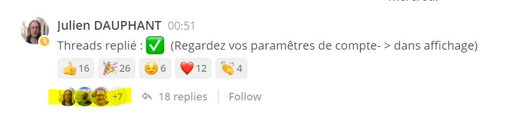

# Comment communiquer sur Mattermost ?

## Prérequis pour profiter d'une expérience optimale

Si tu ne l'as pas déjà fait fait, active l'option "Collapsed Reply Thread" dans `Paramètres du compte > Affichage` 

#### **Active l'option thread** \(version beta pouvant entrainer des risques\)


Cette option permet de réduire la sensation de "bruit" et de retrouver les échanges dans des fils de discussion séparée.


**1.Clique sur les 3 bandes horizontales** 

**2. Clique sur "Paramètres du compte"**

**3. Clique sur "Affichage" puis sur "modifier" dans la partie "Collapsed Reply Threads \(beta\)"**

**4. Choisi "On" puis enregistrer.**

### **Comment répondre à un message ?**

#### 1. Clique dans le message en question sur les « … » puis dans le menu sur « Répondre » :

#### 2. Un bandeau latéral s’ouvre, écris ton message puis cliques sur « ajouter un commentaire » :

Ta réponse apparaît directement dans le canal avec mention que c’est un commentaire et la référence du message d’origine. 

Il faut donc être vigilant à ne pas être trop bavards en commentaires pour ne pas saturer le canal. Dans le cas d’une conversation poussée, il est recommandé de créer une discussion dans un canal dédié.

#### **3. Faire référence à des personnes, des canaux, des mentions**

* Le hashtag \# : pour joindre le message aux autres messages mentionnant le même \#. 
* Le @ : pour taguer quelqu’un et le notifier

#### **4. Partager une publication**

Cliques sur “...” à côté du message en question puis sur “copier le lien

### **Comment chercher des personnes pour envoyer un message personnel ?**

#### 1. Clique sur le « + » à côté de « Messages personnels »

#### 2. Ajoute autant de personnes que nécessaires

### **Comment contacter les membres des autres incubateurs ?**

* Si **l’incubateur en question est sur Mattermost et il est hébergé sur le même serveur que celui de Beta**. L’espace est réparti en différentes équipes. Par défaut tout le monde est dans l’équipe beta.gouv et à ça s’ajoutent des équipes privées pour d’autres structures comme c’est le cas pour data.gouv et bientôt pour l’ANCT. Comme l’équipe Beta.gouv est le dénominateur commun, **tu pourras communiquer avec les membres de ces équipes directement sur l’équipe beta.gouv**.

### **Comment créer un nouveau canal ?**

#### 1. Clique sur le « + », puis sur créer un canal

#### 2. Rempli la description

### **Comment créer une nouvelle catégorie et réorganiser ses canaux** ?

Tu peux créer autant de catégories que tu le souhaites pour organiser ton espace de travail. Les catégories seront visibles uniquement par toi.

#### 1. Clique sur les « … » à côté de « canaux » puis cliques sur « créer une catégorie »

#### 2. Donne un nom à cette catégorie. Ici on reprend la norme de nommage établie sur Slack qui est expliquée[ ici dans les rubriques Préfixes et Double canaux des startups](https://doc.incubateur.net/communaute/travailler-a-beta-gouv/jutilise-les-outils-de-la-communaute/slack) 

#### 3. Déplace des canaux dans vos différentes catégories en « glissé-déposé ».

### **Comment chercher des messages ?**

Dans la barre de recherche en haut à droite. Vous pouvez vous aider d’options de recherche.

