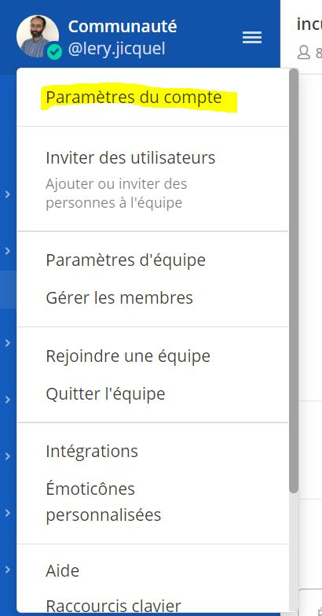

# Comment activer l'option thread/fil ?

## Etape 1**. Clique sur les 3 bandes horizontales**&#x20;

****

## Etape 2. **Clique sur "Paramètres du compte"**

## **Etape 3. Clique sur "Affichage" puis sur "modifier" dans la partie "Collapsed Reply Threads (beta)"**

****

## **Etape 4. Choisis "On" puis enregistrer.**

### ****

## Démo vidéo

#### Collapsed Reply Threads Tutorial


