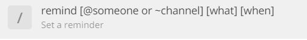

# Comment ajouter un rappel récurrent ?

La fonction "/remind" te permet de programmer des rappels automatiques.

C'est utile si par exemple tu souhaites :

* ajouter un rappel tous les matins à 9h pour le point quotidien de ton équipe
