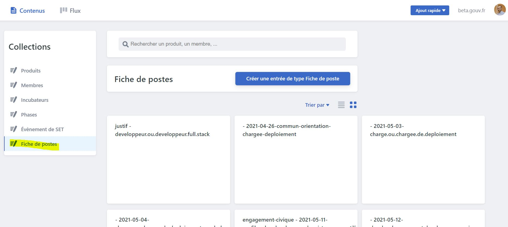

# Publier une offre d'embauche


Pour **créer simplement une offre de recrutement, tu peux utiliser**[ **cette plateforme facile d'utilisation.**](https://beta.gouv.fr/admin)\*\*\*\*

Dès que ton offre sera en ligne, tu pourras **annoncer ton** [**recrutement sur le compte Linkedin de beta.gouv** ](../comprendre-loffre-de-service-de-beta.gouv.fr/nos-services-a-destination/annoncer-un-recrutement-sur-le-compte-linkedin-de-beta.gouv.md)pour toucher plus de candidats potentiels.



Depuis ces liens ["Github" ](https://github.com/betagouv/beta.gouv.fr/tree/master/content/_jobs) ou ["beta.gouv.fr"](https://beta.gouv.fr/recrutement/) tu auras accès à toutes les offres de recrutement passées et en cours. Tu peux t'inspirer de ces offres pour rédiger la tienne. 


Les candidats peuvent envoyer leurs candidatures à l'adresse recrutement@beta.gouv.fr, ça permet aux autres membres de la communauté de prendre connaissance de leurs profils et éventuellement de leur proposer d'autres missions si le recrutement ne se fait pas.

N'hésites pas à demander de l'aide sur Mattermost ou à dinum@beta.gouv.fr.

Une fois que l'offre aura été pourvue, penses à fermer l'offre.

Tu peux également consulter le [guide au recrutement ](comment-recruter.md)beta.gouv.fr.



