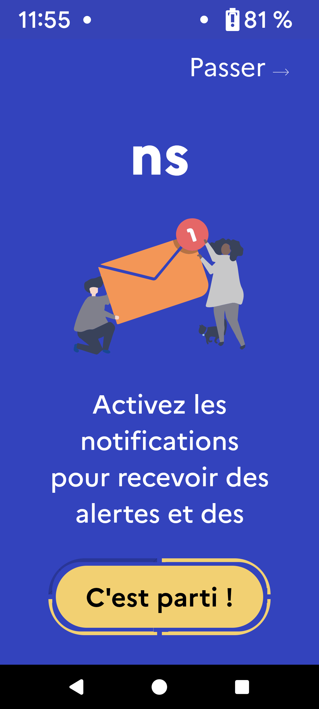
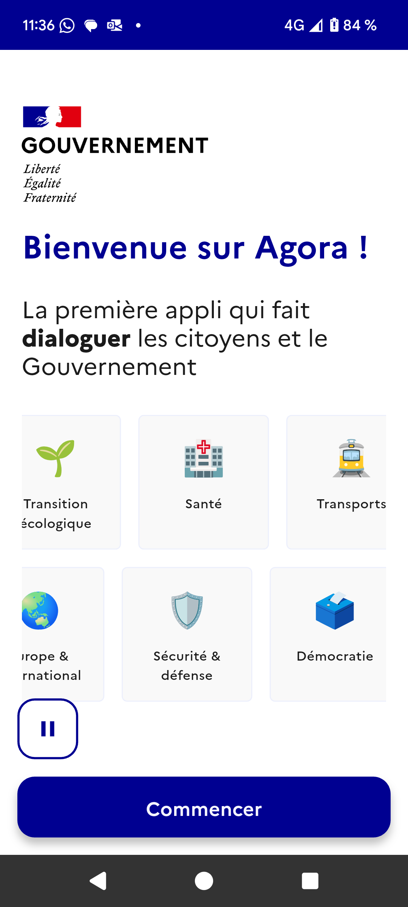

# Bonnes pratiques d'accessibilité des app mobile

Sur une application mobile, il est difficile d’inspecter le code source comme sur le web. Mais il existe plusieurs astuces pour tester et avoir une discussion avec son équipe, car l’**accessibilité est l’affaire de tout le monde !**&#x20;

Il est aussi primordial de connaître les gestes de base des OS et des lecteurs d’écran (Voice Over / Talk Back) pour tester correctement - on vous explique plus bas.

NB. Si vous développez une **application mobile hybride,** nous vous recommandons d’utiliser le package[ Flutter accessibility\_tools](https://pub.dev/packages/accessibility_tools) pour tester votre application.&#x20;

Pour finir, la norme en vigueur pour les applications mobiles est le [RAAM](https://accessibilite.public.lu/fr/raam1.1/index.html) (Référentiel d'évaluation de l'Accessibilité des Applications Mobiles).

## 1/ Contraste 

En respectant le minimum de contraste entre le texte et l'arrière-plan (**contraste de 4,50:1 en mode clair et sombre)**, vous permettez à tous les utilisateurices de pouvoir lire pleinement les textes dans divers contextes (dont l’extérieur).

🧪 Comment tester ?&#x20;

* Android : télécharger l’application mobile [Accessibility Scanner](https://play.google.com/store/apps/details?id=com.google.android.apps.accessibility.auditor\&hl=fr\&pli=1) pour soumettre votre app mobile à des tests d’accessibilité et avoir les résultats et des recommandations.\

* iOS : Utiliser l'outil [Accessibility Inspector](https://developer.apple.com/documentation/accessibility/accessibility-inspector) dans Xcode ou installer Colour Contrast Analyzer sur Windows/Mac

N’oubliez pas de tester en Light et Dark mode.

&#x20;

<figure><figcaption>
Agora - vérifier le niveau de contraste⚠️
</figcaption></figure> <figure><figcaption>
1000 jours - en Dark mode illisible⚠️
</figcaption></figure>

❤️ Vous remercieront : les personnes ayant des troubles de la vision, des difficultés de concentration et toutes les personnes utilisant leurs téléphone mobile dans un environnement avec des conditions lumineuses déplorables.

&#x20;💡Pense-bête :&#x20;

* Ne pas s’appuyer uniquement sur la couleur pour véhiculer une information (hachurage, motif, texte sur la couleur…)&#x20;
* Utiliser le [DSFR](https://www.systeme-de-design.gouv.fr/version-courante/fr/fondamentaux/couleurs--palette) (Design System de l’état) et sa palette de couleur accessible. &#x20;


📱RAAM : [https://accessibilite.public.lu/fr/raam1.1/referentiel-technique.html#crit-2](https://accessibilite.public.lu/fr/raam1.1/referentiel-technique.html#crit-2-2)


## 2/ Titre des écrans

Utile pour se repérer dans l’application (couplé avec le bouton de retour c’est encore mieux).&#x20;

C’est aussi le premier élément qui sera vocalisé au lecteur d’écran.

<figure><figcaption>
Agora - titre unique et pertinent ✅
</figcaption></figure>

🧪 Comment tester ?&#x20;

Android et iOS :&#x20;

* naviguer sur l’application mobile et vérifier pour chaque page &#x20;
  * qu’il y a bien un titre unique&#x20;
  * et pertinent (et pas un titre générique comme le nom de l’app). \`

❤️ Vous remercieront :  toutes les personnes pour faciliter la navigation.&#x20;


📱RAAM : [https://accessibilite.public.lu/fr/raam1.1/referentiel-technique.html#crit-7-](https://accessibilite.public.lu/fr/raam1.1/referentiel-technique.html#crit-7-1)


## 3/ Taille des zones sélectionnables / zone de tap&#x20;

Respecter au minimum pour toutes les zones d'interaction, une taille de **48dp x 48dp** ([Android](https://developer.android.com/guide/topics/ui/accessibility/apps?hl=fr#large-controls)) ou de **44x44 pt** ([pour iOS et Ipad)](https://developer.apple.com/design/human-interface-guidelines/accessibility#Mobility). Cela assure un confort dans l’utilisation de votre application mobile et ce sont aussi les recommandations de Google et Apple.&#x20;

🧪 Comment tester ?&#x20;

* Android et iOS : tester les éléments cliquables sur les extrémités et assurez-vous que cela conduit à l’action souhaitée, sinon vous pourrez avoir une discussion avec l’équipe pour revoir la taille des zones de tap.&#x20;
  * Android : il est aussi possible d’utiliser l’application mobile [Accessibility Scanner](https://play.google.com/store/apps/details?id=com.google.android.apps.accessibility.auditor\&hl=fr\&pli=1) pour avoir les résultats sur “la zone de cible tactile” et des recommandations.
  * iOS : il est aussi possible d’utiliser [Accessibility Inspector dans Xcode](https://developer.apple.com/documentation/accessibility/accessibility-inspector) pour avoir les résultats sur les “hit area” et des recommandations.

<figure><figcaption>
Jardin Mental - zone de tap à améliorer ⚠️
</figcaption></figure>

❤️ Vous remercieront : tout le monde pour interagir et finaliser une action, sans avoir la  sensation de taper à côté et d’être frustré.

💡Pense-bête : les applications mobiles doivent être pensées pour être utilisable à une seule main (gauche ou droite), il y a des zones naturelles de touches en fonction de la taille d’écran.&#x20;


📱 RAAM : ce n’est pas encore un critère d’accessibilité mobile mais une bonne pratique reprise par les stores :)


## 4/ Orientation de l'écran

Ne pas bloquer l’orientation en portrait de votre application, car certaines personnes ont des besoins à pouvoir utiliser votre application en paysage (comme un mobile fixé à un fauteuil roulant).

🧪 Comment tester ?&#x20;

* Android et iOS :  tester votre application en mode portrait et paysage, vous ne devez pas être bloqué.&#x20;

❤️ Vous remercieront : tout le monde et en particulier les personnes ne pouvant pas faire pivoter leur téléphone mobile (déficiences visuelles ou motrices).


📱 RAAM : ce n’est pas encore un critère d’accessibilité mobile mais une bonne pratique  :)


## 5/  Affichage du clavier  

Pour faciliter la saisie des nombres, inutile d’afficher le clavier alphabétique.

<figure><figcaption>
J'agis - affichage du clavier numérique ✅
</figcaption></figure>

🧪 Comment tester ?&#x20;

* Android et iOS :  tester l’affichage du clavier dans un formulaire avec des champs texte ou numérique.&#x20;

❤️ Vous remercieront: toutes les personnes car plus aucune erreur possible !&#x20;


📱 RAAM : ce n’est pas encore un critère d’accessibilité mobile mais une bonne pratique  :)


## 6/ Zoom sans perte d’information

Comme sur le web, il faut pouvoir zoomer et agrandir le texte via le paramétrage de son téléphone. &#x20;

<figure><figcaption>
Agora- informations lisibles ✅
</figcaption></figure> <figure><figcaption>
RecoSante-il manque des infos ⚠️
</figcaption></figure>

🧪 Comment tester ?&#x20;

* Android et iOS : la taille de police est configurable depuis les réglages.
  * Android : depuis les paramètres, rechercher “ Taille de l’affichage” (dépend des surcouches des téléphones mobiles)
  * iOS : depuis les paramètres “Centre de contrôle” > “Taille du texte”
* Augmenter la taille du texte (pour s’approcher des 200% comme sur le web)&#x20;
  * Vérifier que les textes sont lisibles, la navigation toujours possible et qu’il ne manque pas d’éléments graphiques.&#x20;

❤️ Vous remercieront : les personnes malvoyantes, dyslexiques et toutes les personnes qui ont des préférences de lecture et de configuration de téléphone.&#x20;

💡Pense-bête : pensez à coder la taille du texte en taille relative.&#x20;


📱RAAM : [https://accessibilite.public.lu/fr/raam1.1/referentiel-technique.html#crit-8-2](https://accessibilite.public.lu/fr/raam1.1/referentiel-technique.html#crit-8-2)&#x20;


## 7/ Navigation au clavier  

Il est possible d’ajouter un clavier externe (le plus simple est un clavier Bluetooth)  pour naviguer sur les apps mobile.

Pour Android, il existe des[ tutoriels](https://appt.org/en/docs/android/features/keyboard-access) pour connaître les raccourcis de base.&#x20;

Pour iOS, n’oubliez pas d’activer l’option dans Réglages > Accessibilité > Claviers > Accès clavier complet.

🧪 Comment tester ?

* Android et iOS :&#x20;
  * connectez le clavier,&#x20;
  * naviguer pour vérifier qu’il n’y a pas de piège au clavier,&#x20;
  * que les éléments de navigation sont activables (lien, boutons…),
  * que l’ordre est cohérent et correspond au sens de lecture.

Les touches à connaître pour naviguer 

* La touche Tab (⇥) pour passer à l’option suivante,

- les touches Shift puis Tab (⇧+⇥) pour revenir à l’option précédente

* entrée (↵) pour sélectionner,

- espace (▭) pour cocher - décocher une case à cocher,&#x20;

* les flèches (→←↑↓) pour défiler, sélectionner un bouton radio ou une option dans une liste déroulante

* Android : il est possible d’utiliser [Switch Access ](https://support.google.com/accessibility/android/answer/6122836?hl=fr)pour faire le test - application disponible sur le Playstore pour naviguer avec les boutons physiques du téléphone - qui peut remplacer le clavier.

❤️ Vous remercieront : les personnes utilisant la saisie vocale, des technologie d'assistance, les personne aveugle ou avec des troubles moteur.&#x20;

💡 Pense-bête : le clavier permet également d’accéder aux lecteurs d’écran, pensez à les tester également.

## 8/ Lecteur d’écran / Synthèse vocale&#x20;

Pour retranscrire vocalement tout le contenu (écrit ou imagé) sans perte d’information et interagir avec l’application via des gestes.

Les principaux geste à maîtriser :&#x20;

VoiceOver (iOS)

Nous vous recommandons la [documentation officielle](https://support.apple.com/fr-fr/guide/iphone/iph3e2e415f/ios) et également le site d’Orange pour tout [connaître de l’outil VoiceOver](https://a11y-guidelines.orange.com/fr/mobile/ios/voiceover/).

<figure><figcaption></figcaption></figure>

Talk Back (Android)

Nous vous recommandons également la [documentation officielle](https://support.google.com/accessibility/android/answer/6151827?hl=fr\&ref_topic=10601570) et le site Orange pour connaître les gestes à utiliser pour [Talk Back](https://a11y-guidelines.orange.com/fr/mobile/android/test/test-manuel/#le-lecteur-decran-talkback).

<figure><figcaption>
Source : OrangeOrange - Fiche mémo accessibilité
</figcaption></figure>

Dans les deux cas, il est possible d’[afficher la sortie vocale](https://accessibilite.public.lu/fr/raam1/methodologie.html#lecteur-d-ecran)

🧪 Comment tester ?&#x20;

* Android et iOS :&#x20;
  * lancer le lecteur d’écran, &#x20;
  * naviguer et écouter les éléments vocalisés (écrits ou imagés _- critère suivant_),
  * vérifier que le contenu et les fonctionnalités sont retranscrites vocalement à l’identique.&#x20;

❤️ Vous remercieront : les personnes malvoyantes, aveugle, dyslexique, illettrées qui ont besoin de pouvoir vocaliser tous les éléments visibles dans la page.

💡Pense-bête : penser à bien mettre des alternatives textuelles sur des composants insuffisamment informatifs (comme les notifications, les infobulles).  &#x20;


📱RAAM : [https://accessibilite.public.lu/fr/raam1.1/referentiel-technique.html#topic-8](https://accessibilite.public.lu/fr/raam1.1/referentiel-technique.html#topic-8)&#x20;


## 9/ Alternatives aux images

Comme sur le web, les images porteuses d’informations ont besoin d’alternatives qui seront vocalisées par le lecteur d’écran.&#x20;

Une image c’est aussi un icône ou un émoticone ou un élément complexe (graphique, carte…) ;)

🧪 Comment tester ?

* Android et iOS :&#x20;
  * lancer le lecteur d’écran,
  * écouter les éléments vocalisés sur les images porteuses d'informations que vous avez repérés,
  * vérifier la pertinence  de l’alternative avec la vocalisation - au minimum l’information équivalente ou la reprise du texte de l’image si nécessaire.&#x20;

❤️ Vous remercieront : les personnes utilisant un lecteur d’écran et ayant besoin que les informations soient vocalisées.

💡Pense-bête : Pas besoin d’alternative pour les images décoratives (non informatives), car cela brouille la vocalisation (répétitions, informations non pertinentes).&#x20;


📱RAAM : [https://accessibilite.public.lu/fr/raam1.1/referentiel-technique.html#topic-1](https://accessibilite.public.lu/fr/raam1.1/referentiel-technique.html#topic-1)&#x20;


## 10/ Langue principale de l'écran&#x20;

Pour rendre la vocalisation dans la langue choisie par l'utilisateur (qui s’effectue par défaut dans la langue du système du téléphone mobile).

\
🧪 Comment tester ?

* Android et iOS :&#x20;
  * lancer le lecteur d’écran,&#x20;
  * &#x20;vérifier que la vocalisation du texte est dans la langue principale de l’écran.&#x20;

❤️ Vous remercieront : les personnes qui ont des besoins de vocalisation. &#x20;


📱RAAM : [https://accessibilite.public.lu/fr/raam1.1/referentiel-technique.html#crit-6-1](https://accessibilite.public.lu/fr/raam1.1/referentiel-technique.html#crit-6-1)


## 11/Formulaire

C’est toujours une partie stressante pour les utilisateurices, alors aidons les un maximum à pouvoir saisir la bonne information dans le bon champ.

Comme sur le web, il faut lier les champs de formulaires avec leurs étiquettes (labels) pour apporter une vocalisation indiquant ce qu’il faut saisir (le contenu attendu).&#x20;

🧪 Comment tester ?&#x20;

* Android et iOS : &#x20;
  * lancer le lecteur d’écran
  * écouter les éléments vocalisés sur les champs de formulaires que vous avez repérés ( = étiquette est bien restituée).

Android : utiliser aussi  Accessibility scanner qui remonte le manque de vocalisation des étiquettes / labels  (attention aux faux positifs que j’ai moi-même eu en testant des formulaires dans les app mobiles).

<figure><figcaption>
Formulaire J'Agis - vérifier le libellé ⚠️
</figcaption></figure>

❤️ Vous remercieront : tout le monde !&#x20;

💡Pense-bête :

* indiquer les champs obligatoires,&#x20;
* le format attendu dans le champ,&#x20;
* vérifier que les statuts des écrans sont accessibles (message vocalisé au lecteur d'écran suite à une soumission réussie ou une erreur)
* et pour les erreur de saisie de bien expliquer et suggérer une piste de correction (et pas seulement par la couleur).&#x20;


📱RAAM : [https://accessibilite.public.lu/fr/raam1.1/referentiel-technique.html#topic-9](https://accessibilite.public.lu/fr/raam1.1/referentiel-technique.html#topic-9)&#x20;


## 12/ Son et mouvement&#x20;

Le lancement d’un son automatique perturbe les personnes utilisant un lecteur d'écran (principe de non-interférence).  Il faut laisser la personne pouvoir stopper ou décider ne pas lancer l'animation. Nous vous recommandons aussi de ne pas utiliser les clignotements avec plus de 3 flashs par seconde (risque de provoquer une crises d'épilepsie).&#x20;

<figure><figcaption>
Agora - possibilité de stopper le mouvement✅
</figcaption></figure>

🧪 Comment tester ?&#x20;

* Android et iOS :&#x20;
  * au chargement de l’écran repérer si le son a une durée supérieure à 3 secondes&#x20;
  * alors vérifier la présence d’un bouton pour contrôler la lecture de chaque contenu animé, ou que le volume peut être contrôlé par l’utilisateur. &#x20;

❤️ Vous remercieront : les personnes malvoyantes, et toutes celles ne souhaitant pas être perturbée pendant le parcours.&#x20;


📱RAAM (son) : [https://accessibilite.public.lu/fr/raam1.1/referentiel-technique.html#crit-3-12](https://accessibilite.public.lu/fr/raam1.1/referentiel-technique.html#crit-3-12)&#x20;

📱RAAM (mouvement) :[https://accessibilite.public.lu/fr/raam1.1/referentiel-technique.html#crit-11-8](https://accessibilite.public.lu/fr/raam1.1/referentiel-technique.html#crit-11-8)&#x20;


## 13/ Compatibilité avec les options embarquées d’accessibilité&#x20;

Tous les téléphones mobiles ont  des fonctionnalités d'accessibilité (en plus du lecteur d’écran).

<figure><figcaption>
Option d'accessibilité iOS
</figcaption></figure> <figure><figcaption>
Option d'accessibilité Android
</figcaption></figure>

🧪 Comment tester ?&#x20;

Android et iOS : &#x20;

* activer les options,
* &#x20;vérifier que votre application mobile fonctionne et offre la même qualité d’expérience utilisateur.

❤️ Vous remercieront : toutes les personnes utilisant ces options d’accessibilité


📱RAAM : [https://accessibilite.public.lu/fr/raam1.1/referentiel-technique.html#crit-12-3](https://accessibilite.public.lu/fr/raam1.1/referentiel-technique.html#crit-12-3)


## Pour aller plus loin avec nos ressources  ...&#x20;

* [Mobile accessibility mapping](https://www.w3.org/TR/mobile-accessibility-mapping/) par W3C&#x20;
* [Mémo application mobile](https://a11y-guidelines.orange.com/fr/articles/memo-accessibilite/#liste-des-memos/) pour Android et iOS par Accessibilité Numérique Orange
* [108 critères du RAAM ](https://accessibilite.public.lu/fr/raam1.1/index.html)
* [Guide Android pour l'accessibilité](https://developer.android.com/guide/topics/ui/accessibility/apps?hl=fr#test)&#x20;
* [Guide iOS pour l’accessibilité ](https://developer.apple.com/design/human-interface-guidelines/accessibility)
* Doc de[ référence Apple](https://developer.apple.com/library/ios/#documentation/UserExperience/Conceptual/iPhoneAccessibility/Making_Application_Accessible/Making_Application_Accessible.html#//apple_ref/doc/uid/TP40008785-CH102-SW1) sur l’accessibilité
* [Liste des gestes sur iOS ](https://support.apple.com/fr-fr/guide/iphone/iph3e2e2281/16.0/ios/16.0)
* [Liste des gestes sur Android](https://support.google.com/accessibility/android/answer/6151827?hl=fr)
* [Guide d’audit d’application mobile](https://github.com/DISIC/guide-mobile_app_audit) par la Direction interministérielle du Numérique

\
\
\

