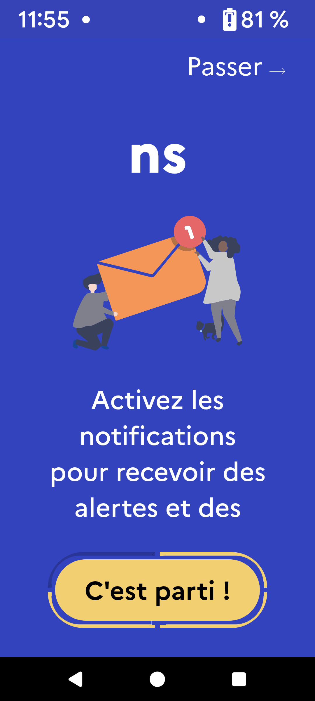
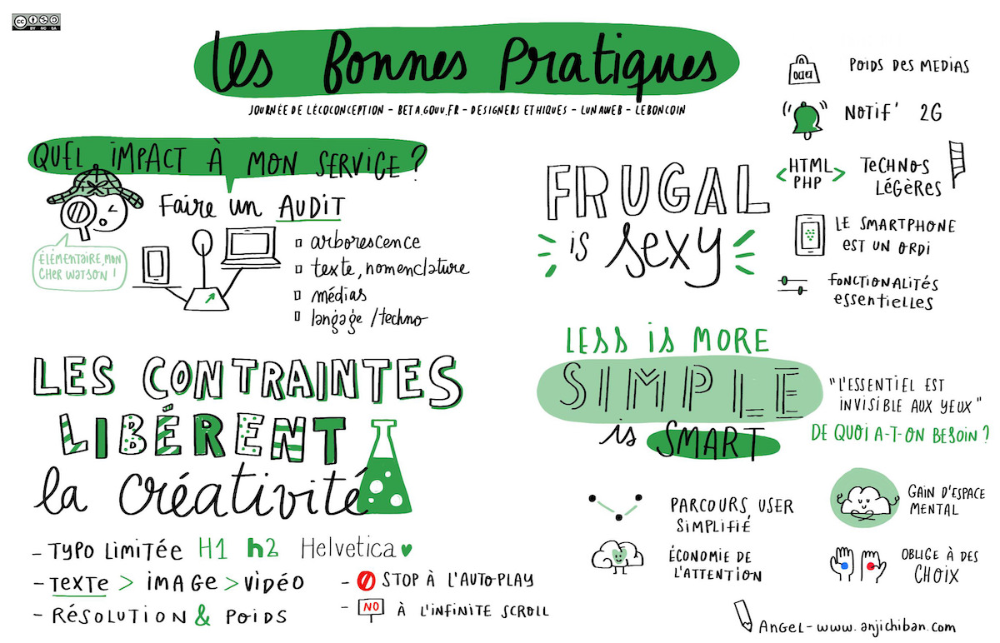
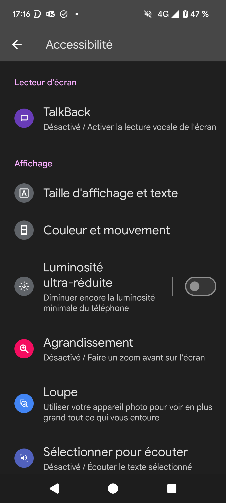

# Apps mobiles et accessibilité

Voici quelques vérifications à faire en équipe pour s'assurer que votre application mobile est accessible.

### Mobile : une approche différente du web

Pour vérifier l'accessibilité d'une application mobile, il est difficile d’inspecter le code source comme sur le web. Mais il existe cependant **différentes techniques** :

* Faire des tests automatiques avec des applications dédiées
* Faire des tests manuels
* Tester avec le lecteur d'écran intégré l'OS
* Utiliser des packages dédiés (par exemple [Flutter accessibility\_tools](https://pub.dev/packages/accessibility_tools) pour les applications mobiles hybrides)

### Tests automatiques 

Ces applications permettent de faciliter la vérification de certains aspects.

* Sur Android : télécharger l’application mobile [Accessibility Scanner](https://play.google.com/store/apps/details?id=com.google.android.apps.accessibility.auditor\&hl=fr\&pli=1)
* Sur iOS : Utiliser l’outil [Accessibility Inspector](https://developer.apple.com/documentation/accessibility/accessibility-inspector) dans Xcode

#### Contraste 

En respectant le minimum de contraste entre le texte et l'arrière-plan (contraste de 4,50 : 1 en mode clair et sombr&#x65;**)**, vous permettez à tous les utilisateurices de pouvoir lire pleinement les textes dans divers contextes (par exemple écran ensoleillé).

**🧪 Comment tester ?**

* Sur Android : avec [Accessibility Scanner](https://play.google.com/store/apps/details?id=com.google.android.apps.accessibility.auditor\&hl=fr\&pli=1)
* Sur iOS : avec [Accessibility Inspector](https://developer.apple.com/documentation/accessibility/accessibility-inspector) dans Xcode ou [Colour Contrast Analyzer](https://www.tpgi.com/color-contrast-checker/) sur Windows/Mac.

N’oubliez pas de tester en Light et Dark mode.

<figure><figcaption>
⚠️ Le conseil (0/50) n'est pas assez contrasté
</figcaption></figure> <figure><figcaption>
⚠️ Le Dark mode illisible
</figcaption></figure>


Elles vous remercieront : les personnes ayant des troubles de la vision, des difficultés de concentration et toutes les personnes utilisant leurs téléphone mobile dans un environnement avec des conditions lumineuses déplorables.


Pense-bête :

* Utiliser le [DSFR](https://www.systeme-de-design.gouv.fr/version-courante/fr/fondamentaux/couleurs--palette) (Design System de l’état) et sa palette de couleur accessible.
* Ne pas s’appuyer uniquement sur la couleur pour véhiculer une information (on peut utiliser un hachurage, des motifs, du texte sur la couleur…)


[Thématique **Couleurs** du RAAM](https://accessibilite.public.lu/fr/raam1.1/referentiel-technique.html#crit-2)


#### Taille des zones de tap

Respecter au minimum pour toutes les zones d'interaction, une taille de **48 dp x 48 dp** ([Android](https://developer.android.com/guide/topics/ui/accessibility/apps?hl=fr#large-controls)) ou de **44 x 44 pt** ([iOS et Ipad)](https://developer.apple.com/design/human-interface-guidelines/accessibility#Mobility). Cela assure un confort dans l’utilisation de votre application mobile et ce sont aussi les recommandations de Google et Apple.

**🧪 Comment tester ?**

Tester les éléments cliquables sur les extrémités et assurez-vous que cela conduit à l’action souhaitée, sinon vous pourrez avoir une discussion avec l’équipe pour revoir la taille des zones de tap.

* Sur Android : l’application mobile [Accessibility Scanner](https://play.google.com/store/apps/details?id=com.google.android.apps.accessibility.auditor\&hl=fr\&pli=1) indique des recommandations pour les “zones de cibles tactiles”.
* Sur iOS : [Accessibility Inspector dans Xcode](https://developer.apple.com/documentation/accessibility/accessibility-inspector) indique des recommandations sur les “hit area”.

<figure><figcaption>
⚠️ La zone de tap sera trop petite pour certaines personnes.
</figcaption></figure>


Elles vous remercieront : tout le monde pour interagir et finaliser une action, sans avoir la sensation de taper à côté et d’être frustré.


💡Pense-bête : les applications mobiles doivent être pensées pour être utilisable à une seule main (gauche ou droite), il y a des zones naturelles de touches en fonction de la taille d’écran.

### Tests manuels

#### Orientation de l'écran

Ne pas bloquer l’orientation en portrait de votre application, car certaines personnes ont des besoins à pouvoir utiliser votre application en paysage (comme un mobile fixé à un fauteuil roulant).

**🧪 Comment tester ?** Tester votre application en mode portrait et paysage, vous ne devez pas être bloqué.


Elles vous remercieront : tout le monde et en particulier les personnes ne pouvant pas faire pivoter leur téléphone mobile (déficiences visuelles ou motrices).



[Critère 11.9 du RAAM](https://accessibilite.public.lu/fr/raam1.1/referentiel-technique.html#crit-11-9) : Dans chaque écran, le contenu proposé est-il consultable quelle que soit l’orientation de l’écran (portrait ou paysage) (hors cas particuliers) ?


#### Affichage du clavier 

Pour faciliter la saisie des nombres, inutile d’afficher le clavier alphabétique.

<figure><figcaption>
✅ Le clavier numérique s'affiche pour les champs numériques
</figcaption></figure>

**🧪 Comment tester ?** Tester l’affichage du clavier dans un formulaire avec des champs texte ou numérique.


Elles vous remercieront : toutes les personnes car plus aucune erreur possible !


#### Zoom sans perte d’information

Comme sur le web, il faut pouvoir zoomer et agrandir le texte via le paramétrage de son téléphone.

<figure><figcaption>
✅ Les informations sont toujours lisibles au zoom
</figcaption></figure> <figure><figcaption>
⚠️ Certaines informations sont masquées quand on zoome.
</figcaption></figure>

**🧪 Comment tester ?**

* La taille de police est configurable depuis les réglages :
  * Sur Android : depuis les paramètres, rechercher “ Taille de l’affichage” (dépend des surcouches des téléphones mobiles)
  * Sur iOS : depuis les paramètres “Centre de contrôle” > “Taille du texte”
* Augmenter la taille du texte (pour s’approcher des 200% comme sur le web)
  * Vérifier que les textes sont lisibles, la navigation toujours possible et qu’il ne manque pas d’éléments graphiques.


Elles vous remercieront : les personnes malvoyantes, dyslexiques et toutes les personnes qui ont des préférences de lecture et de configuration de téléphone.


💡Pense-bête : pensez à coder la taille du texte en taille relative.


[Critère 8.2 du RAAM](https://accessibilite.public.lu/fr/raam1.1/referentiel-technique.html#crit-8-2) : Dans chaque écran, l’utilisateur peut-il augmenter la taille des caractères de 200% au moins (hors cas particuliers) ?


#### Navigation au clavier 

Il est possible d’ajouter un clavier externe (le plus simple est un clavier Bluetooth) pour naviguer sur les apps mobile. C'est ce que font par exemple certaines personnes aveugles.

* Pour Android, il existe des[ tutoriels](https://appt.org/en/docs/android/features/keyboard-access) pour connaître les raccourcis de base.
* Pour iOS, n’oubliez pas d’activer l’option dans Réglages > Accessibilité > Claviers > Accès clavier complet.

**🧪 Comment tester ?**

* Connectez le clavier
* Naviguer pour vérifier que :
  * il n’y a pas de piège au clavier
  * les éléments de navigation sont activables (lien, boutons…),
  * l’ordre est cohérent et correspond au sens de lecture.

Les touches à connaître pour naviguer :

* Tab (⇥) pour passer à l’option suivante,
* Shift et Tab (⇧+⇥) pour revenir à l’option précédente
* Entrée (↵) pour sélectionner,
* Espace (▭) pour cocher / décocher une case à cocher,
* Les flèches (→ ← ↑ ↓) pour défiler, sélectionner un bouton radio ou une option dans une liste déroulante

* Sur Android : [Switch Access](https://support.google.com/accessibility/android/answer/6122836?hl=fr) permet d'utiliser un clavier au lieu de l'écran tactile pour interagir avec l'app.


Elles vous remercieront : les personnes utilisant la saisie vocale, des technologie d'assistance, les personne aveugle ou avec des troubles moteur.


#### Son et mouvement

Le lancement d’un son automatique perturbe les personnes utilisant un lecteur d'écran (principe de non-interférence). Il faut laisser la personne pouvoir stopper ou décider ne pas lancer l'animation. Nous vous recommandons aussi de ne pas utiliser les clignotements avec plus de 3 flashs par seconde (risque de provoquer une crises d'épilepsie).

**🧪 Comment tester ?**

* Au chargement de l’écran, repérer si le son a une durée supérieure à 3 secondes
* Si oui, vérifier la présence d’un bouton pour contrôler la lecture de chaque contenu animé, ou que le volume peut être contrôlé par l’utilisateur.


Elles vous remercieront : les personnes malvoyantes, et toutes celles ne souhaitant pas être perturbée pendant le parcours.



[Critère 3.12 du RAAM](https://accessibilite.public.lu/fr/raam1.1/referentiel-technique.html#crit-3-12) : Chaque séquence sonore déclenchée automatiquement est-elle contrôlable par l’utilisateur ?

[Critère 11.8 du RAAM](https://accessibilite.public.lu/fr/raam1.1/referentiel-technique.html#crit-11-8) : Dans chaque écran, chaque contenu en mouvement ou clignotant est-il contrôlable par l’utilisateur ?


### Avec un lecteur d’écran / une synthèse vocale

Pour retranscrire vocalement tout le contenu (écrit ou imagé) sans perte d’information et interagir avec l’application via des gestes.

Les principaux geste à maîtriser :

VoiceOver (iOS)

Nous vous recommandons la [documentation officielle](https://support.apple.com/fr-fr/guide/iphone/iph3e2e415f/ios) et également le site d’Orange pour tout [connaître de l’outil VoiceOver](https://a11y-guidelines.orange.com/fr/mobile/ios/voiceover/).

<figure><figcaption></figcaption></figure>

Talk Back (Android)

Nous vous recommandons également la [documentation officielle](https://support.google.com/accessibility/android/answer/6151827?hl=fr\&ref_topic=10601570) et le site Orange pour connaître les gestes à utiliser pour [Talk Back](https://a11y-guidelines.orange.com/fr/mobile/android/test/test-manuel/#le-lecteur-decran-talkback).

<figure><figcaption>
Source : OrangeOrange - Fiche mémo accessibilité
</figcaption></figure>

Dans les deux cas, il est possible d’[afficher la sortie vocale](https://accessibilite.public.lu/fr/raam1/methodologie.html#lecteur-d-ecran)

**🧪 Comment tester ?**

* Lancer le lecteur d’écran,
* Naviguer et écouter les éléments vocalisés
* Vérifier que le contenu et les fonctionnalités sont retranscrites vocalement à l’identique.


Elles vous remercieront : les personnes malvoyantes, aveugle, dyslexique, illettrées qui ont besoin de pouvoir vocaliser tous les éléments visibles dans la page.


💡Pense-bête : penser à bien mettre des alternatives textuelles sur des composants insuffisamment informatifs (comme les notifications, les infobulles).


[Thématique **Présentation de l’information** du RAAM](https://accessibilite.public.lu/fr/raam1.1/referentiel-technique.html#topic-8)


#### Alternatives aux images

Comme sur le web, les images porteuses d’informations ont besoin d’alternatives qui seront vocalisées par le lecteur d’écran.

Une image c’est aussi un icône ou un émoticone ou un élément complexe (graphique, carte…)

**🧪 Comment tester ?**

* Lancer le lecteur d’écran
* Écouter les éléments vocalisés sur les images porteuses d'informations que vous avez repérés
* Vérifier la pertinence de l’alternative avec la vocalisation - au minimum l’information équivalente ou la reprise du texte de l’image si nécessaire.


Elles vous remercieront : les personnes utilisant un lecteur d’écran et ayant besoin que les informations soient vocalisées.


💡Pense-bête : Pas besoin d’alternative pour les images décoratives (non informatives), car cela brouille la vocalisation (répétitions, informations non pertinentes).


[Thématique **Éléments graphiques** du RAAM](https://accessibilite.public.lu/fr/raam1.1/referentiel-technique.html#topic-1)


#### Langue principale de l'écran

Il est possible de modifier la langue principale du téléphone depuis les paramètres système. Il est donc utile de vérifier que la vocalisation est énoncée dans la langue choisie.

\
**🧪 Comment tester ?**

* Lancer le lecteur d’écran
* Vérifier que la vocalisation du texte est dans la langue principale de l’écran.


Elles vous remercieront : les personnes qui ont des besoins de vocalisation.



[Critère 6.1 du RAAM](https://accessibilite.public.lu/fr/raam1.1/referentiel-technique.html#crit-6-1) : Dans chaque écran, les textes sont-ils restitués par les technologies d’assistance dans la langue principale de l’écran ?


#### Titre des écrans

C’est le premier élément qui sera vocalisé au lecteur d’écran. Il serait aussi utile pour se repérer dans l’application (couplé avec le bouton de retour c’est encore mieux).

<figure><figcaption>
✅ La page a bien un titre
</figcaption></figure>

**🧪 Comment tester ?**

* Naviguer sur l’application mobile et vérifier pour chaque page
  * qu’il y a bien un titre unique
  * et pertinent (et pas un titre générique comme le nom de l’app).


Elles vous remercieront : toutes les personnes pour faciliter la navigation.



[Critère 7.1 du RAAM](https://accessibilite.public.lu/fr/raam1.1/referentiel-technique.html#crit-7-1) : Dans chaque écran, l’information est-elle structurée par l’utilisation appropriée de titres ?


#### Formulaire

C’est toujours une partie stressante pour les utilisateurices, alors aidons les un maximum à pouvoir saisir la bonne information dans le bon champ.

Comme sur le web, il faut lier les champs de formulaires avec leurs étiquettes (labels) pour apporter une vocalisation indiquant ce qu’il faut saisir (le contenu attendu).

**🧪 Comment tester ?**

* Lancer le lecteur d’écran
* Écouter les éléments vocalisés sur les champs de formulaires que vous avez repérés (c'est à dire que l'étiquette est bien restituée).
* Sur Android : _Accessibility Scanner_ remonte aussi le manque de vocalisation des étiquettes / labels (attention toutefois aux faux positifs).

<figure><figcaption>
⚠️ Il faudra vérifier manuellement le libellé de ce champ
</figcaption></figure>


Ils vous remercieront : tout le monde !


💡Pense-bête :

* Indiquer les champs obligatoires
* Indiquer le format attendu dans le champ
* Vérifier que les statuts des écrans sont accessibles (message vocalisé au lecteur d'écran suite à une soumission réussie ou une erreur)
* Expliquer les erreurs de saisie et suggérer une piste de correction (et pas seulement par la couleur).


[Thématique **Formulaires** du RAAM](https://accessibilite.public.lu/fr/raam1.1/referentiel-technique.html#topic-9)


### Compatibilité avec les options embarquées d’accessibilité

Tous les téléphones mobiles ont des fonctionnalités d'accessibilité (en plus du lecteur d’écran).

<figure><figcaption>
Option d'accessibilité iOS
</figcaption></figure> <figure><figcaption>
Option d'accessibilité Android
</figcaption></figure>

**🧪 Comment tester ?**

* Activer les options
* Vérifier que votre application mobile fonctionne et offre la même qualité d’expérience utilisateur.


Elles vous remercieront : toutes les personnes utilisant ces options d’accessibilité



📱 [Critère 12.3 du RAAM](https://accessibilite.public.lu/fr/raam1.1/referentiel-technique.html#crit-12-3) : L’application ne perturbe pas les fonctionnalités d’accessibilité de la plateforme. Cette règle est-elle respectée ?


## Pour aller plus loin

* Référentiels
  * [RAAM (Référentiel d’évaluation de l’accessibilité des applications mobiles)](https://accessibilite.public.lu/fr/raam1.1/index.html)
  * [Mobile Accessibility: How WCAG 2.0 and Other W3C/WAI Guidelines Apply to Mobile](https://www.w3.org/TR/mobile-accessibility-mapping/) (en) par W3C
* Guides Android
  * [Guide pour l’accessibilité](https://developer.android.com/guide/topics/ui/accessibility/apps?hl=fr#test)
  * [Liste des gestes sur Android](https://support.google.com/accessibility/android/answer/6151827?hl=fr)
* Guide iOS
  * [Guide pour l’accessibilité](https://developer.apple.com/design/human-interface-guidelines/accessibility)
  * [Référence Apple](https://developer.apple.com/library/ios/#documentation/UserExperience/Conceptual/iPhoneAccessibility/Making_Application_Accessible/Making_Application_Accessible.html#//apple_ref/doc/uid/TP40008785-CH102-SW1) sur l’accessibilité
  * [Liste des gestes sur iOS](https://support.apple.com/fr-fr/guide/iphone/iph3e2e2281/16.0/ios/16.0)
* [Mémo Application mobile pour Android et iOS](https://a11y-guidelines.orange.com/fr/articles/memo-accessibilite/#liste-des-memos/) par Orange
* [Guide d’audit d’application mobile](https://github.com/DISIC/guide-mobile_app_audit) par la DINUM

\
\
\\
