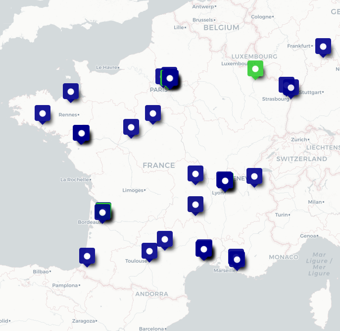

# Les lieux de la communauté

Des membres de la communauté beta.gouv.fr travaillent un peu partout en France. Il existe une carte qui les recense. Tous les membres qui le souhaitent peuvent la [consulter](http://umap.openstreetmap.fr/fr/map/la-communaute-betagouv_498937) ou la [mettre à jour](http://umap.openstreetmap.fr/fr/map/anonymous-edit/498937:rNZ9vgD45VPxZlCh2TPIJoO6K0A) (pour ajouter une position, cliquez en haut à droite sur le stylo puis sur Ajouter un marqueur. Dans le marqueur, saisi ton nom-prénom, pour pouvoir être contacté·e sur Mattermost). Tu pourras ainsi peut-être trouver un membre près de chez toi pour télétravailler ensemble, partager un coworking ou tout simplement un ☕️.

## Paris

### L'ETAP

L'ETAP (Espace de Travail de l'Agent Public) est le 1er espace de coworking entièrement dédié aux agents publics : il est accessible, gratuitement et sur réservation, à tous les membres de la communauté ayant une adresse en .gouv.fr (donc en @beta.gouv.fr).

* ETAP 75 - 47 rue Le Peletier, 75009 Paris
* ETAP 91 - boulevard de France, 91919 Evry-Courcouronnes
* ETAP 94 - 21-29 avenue du Général de Gaulle, 94000 Créteil
* ETAP 95 - 5 avenue Bernard Hirsch, 95000 Cergy

Lien d'inscription / réservation : [https://etap-prefecture.fr/reserver-un-etap/](https://etap-prefecture.fr/reserver-un-etap/)

### Le lieu de la DITP

77 avenue de Ségur, 75015

Tél : 01 79 84 33 00

Mail : lelieu.ditp@modernisation.gouv.fr

Le Lieu de la transformation publique est un espace commun dédié aux travaux des laboratoires d’innovation et des équipes de transformation publique des administrations. Les espaces du Lieu sont exclusivement proposés aux travaux d’intelligence collective (Design sprints, Idéathons, Hackathons, Co-Dev, Ateliers de formation…) et ne sont pas destinés à accueillir de simples réunions, ou des séminaires.

Il est accessible uniquement sur réservation en remplissant le formulaire suivant : [https://demarche.numerique.gouv.fr/commencer/accompagnement-par-le-lieu](https://demarche.numerique.gouv.fr/commencer/accompagnement-par-le-lieu)

### La Plateforme de l'inclusion

6 boulevard St Denis, 75010 Paris

Il arrive que des places soient inoccupées dans les locaux du [GIP Plateforme de l'inclusion](https://inclusion.gouv.fr) et de [la Mednum](https://lamednum.coop) pour des individus. Les salles de réunion ne sont malheureusement pas disponibles pour accueillir des groupes extérieurs.

Faire une demande sur le canal Mattermost [\~gip-inclusion-locaux](https://mattermost.incubateur.net/betagouv/channels/gip-inclusion-locaux), pour voir s'il reste de la place et qui sera là pour vous ouvrir.

### 6-LAB, activateur à projet des Ministères sociaux

14 avenue Duquesne, 75007 Paris

07 62 93 81 43

6-LAB@sg.social.gouv.fr

### La Fabrique Numérique

La Grande Arche Paroi sud 92055 LA DÉFENSE CEDEX

fabrique.projets@developpement-durable.gouv.fr

Pour les startups du MTE.

### La Fabrique RH

55 boulevard Vincent Auriol, 75013 Paris

pref-fabriqueRH@paris.gouv.fr

[https://la-fabrique-rh.wixsite.com/fabriquerh](https://la-fabrique-rh.wixsite.com/fabriquerh)

### SportLab

95, avenue de France 6ème étage - ascenseur est 75013 PARIS

ds-transfolab@sports.gouv.fr

01 45 55 97 09

### Malt

[18 Rue Godot de Mauroy, 75009 Paris](https://maps.app.goo.gl/2EeJPGVq3eo1uBxQ7)

Malt met à disposition un espace de coworking dans ses locaux à destination des équipes de la communauté beta.gouv. C'est ouvert aux agents et aux freelances qui sont référencés sur la plateforme Malt.

Infos et réservation : [https://www.malt.fr/c/freelancers/coworking-space](https://www.malt.fr/c/freelancers/coworking-space)

## Rennes

Une question ? 👉 [\~bureaux-bretagne](https://mattermost.incubateur.net/betagouv/channels/bureaux-bretagne)

### [La Cordée Rennes](https://www.la-cordee.net/cordee/rennes/rennes-lices/)

1 Carrefour Jouaust 35000 Rennes

Pour:

* venir travailler seul à la journée :
  * devenir membre (35€HT/mois pour un accès à toutes les cordées de France + \~3€/heure 👉 [les tarifs](https://www.la-cordee.net/nos-tarifs-ht-lyon-annecy-nantes-rennes/))
  * se faire inviter occasionnellement par un membres de beta.gouv.fr (poser la question sur [\~bureaux-bretagne](https://mattermost.incubateur.net/betagouv/channels/bureaux-bretagne))
* réserver une salle de réunion : possible sans être membre et sans abonnement, paiement à la demi-journée, 2 salles de \~ 5 à 10 places dispo 👉 [les salles](https://www.la-cordee.net/salles-de-reunion/)

### [Tilab](https://www.bretagne.bzh/actualites/ti-lab-laboratoire-regional-dinnovation-publique/)

Espace de la région Bretagne 5 Rue Martenot, 35000 Rennes tilab@bretagne.bzh

## Lyon

Une question ? 👉 [\~bureaux-betalyon](https://mattermost.incubateur.net/betagouv/channels/bureaux-betalyon)

### Le Lab Pôle Emploi

📍 13 rue Crépet, 69007 Lyon Pourquoi : événement Pré-recquis : demander à lelab.69188@pole-emploi.fr

### [L’Archipel](http://lab-archipel.fr)

33 Rue Moncey, 69003 Lyon Contact-archipel@auvergne-rhone-alpes.gouv.fr 04.72.61.60.60

### [La Cordée](https://www.la-cordee.net/cordee/lyon/lyon/)

5 espaces !

Pour:

* venir travailler seul à la journée :
  * soit devenir membre (plusieurs formules, à partir de 35€HT/mois pour un accès à toutes les cordées de France + \~3€/heure 👉 [les tarifs](https://www.la-cordee.net/nos-tarifs-ht-lyon-annecy-nantes-rennes/))
  * soit se faire inviter par un des membres de beta
* réserver une salle de réunion : possible sans être membre et sans abonnement, paiement à la demi-journée, prix très abordables, notamment pour des séminaires 👉 [les salles](https://www.la-cordee.net/salles-de-reunion/)

## Nantes

Une question ? 👉 [\~bureaux-Nantes](https://mattermost.incubateur.net/betagouv/channels/nantes-coworking)

### [Etat’LIN](https://www.prefectures-regions.gouv.fr/pays-de-la-loire/Region-et-institutions/Organisation-administrative-de-la-region/Secretariat-General-pour-les-Affaires-Regionales-SGAR/Etat-LIN-le-Laboratoire-d-innovation-territoriale-de-l-Etat-en-region-Pays-de-la-Loire/Etat-LIN-c-est-quoi/#titre)

6 quai Ceineray, 44000 Nantes - Pays de la Loire etatlin@pays-de-la-loire.gouv.fr\
Plus d'informations sur le canal [\~bureaux-Nantes](https://mattermost.incubateur.net/betagouv/channels/nantes-coworking))

### [La Cordée Nantes](https://www.la-cordee.net/cordee/nantes/sur-erdre/)

33 rue de Strasbourg, 44000 Nantes, à côté de l'Erdre et pas loin de la gare/

Pour:

* venir travailler seul à la journée :
  * soit devenir membre (plusieurs formules, à partir de 35€HT/mois pour un accès à toutes les cordées de France + \~3€/heure 👉 [les tarifs](https://www.la-cordee.net/nos-tarifs-ht-lyon-annecy-nantes-rennes/))
  * soit se faire inviter par un des membres de beta (poser la question sur [\~bureaux-Nantes](https://mattermost.incubateur.net/betagouv/channels/nantes-coworking))
* réserver une salle de réunion : possible sans être membre et sans abonnement, paiement à la demi-journée, prix très abordables, notamment pour des séminaires 👉 [les salles](https://www.la-cordee.net/salles-de-reunion/)

## Rouen

### Innov’Mandie

7 place de la Madeleine, 76000 Rouen

02 32 76 50 90

innovmandie@normandie.gouv.fr

## Toulon

### Insolab

Place Georges Pompidou 83000 Toulon

insolab@tvt.fr

## Bordeaux

Une question ? 👉 [\~bureaux-bordeaux](https://mattermost.incubateur.net/betagouv/channels/bureaux-bordeaux)

### [La Base](https://www.labase-na.fr/)

Conseil départemental de la Gironde Cours du Maréchal Juin, 33000 Bordeaux

contact@labase-na.fr

(Pour organiser des réunions et ateliers - ce n'est pas un espace de coworking. Penser à résérver bien en avance.)

## Dijon

### Lab d'innovations de l'Etat en BFC

55 rue de la Préfecture, 21000 DIJON

innovation-bfc@bfc.gouv.fr

## Strasbourg

Une question ? 👉 [\~bureaux-Strasbourg](https://mattermost.incubateur.net/betagouv/channels/bureaux-strasbourg)

### Lab'EST

5, place de la République, 67000 STRASBOURG

modernisation@grand-est.gouv.fr

## Toulouse

Une question ? [\~bureaux-Toulouse](https://mattermost.incubateur.net/betagouv/channels/entre-toulousains)

### [LabO](https://www.prefectures-regions.gouv.fr/occitanie/Region-et-institutions/L-action-de-l-Etat/Transition-numerique-de-l-Etat-et-modernisation-de-l-action-publique/Laboratoire-d-innovations/Laboratoire-d-innovations)

32 rue Pierre Paul Riquet, 31000 Toulouse

toulouse@citedelarse.fr

## Limoges

### [Laboratoire numérique de l'ASP (Agence de Services et de Paiement)](https://www.asp-public.fr)

2 rue du Maupas, 87000 LIMOGES

laboratoire-numerique@asp-public.fr

05 55 12 04 94

## Lille

### Siilab

[2 Bd de Strasbourg, 59000 Lille](https://www.google.fr/maps/place/Siilab/@50.6178911,3.0487229,17z/data=!3m1!4b1!4m6!3m5!1s0x47c2d5823024b6bd:0x99b62686d16b46eb!8m2!3d50.6178877!4d3.0512978!16s%2Fg%2F11h2f0038q?entry=tts\&g_ep=EgoyMDI1MDMwNC4wIPu8ASoASAFQAw%3D%3D)

christophe.trouillard@jscs.gouv.fr

## Metz

### Le bon plan du messin

À **Metz** les membres de la communauté beta seront toujours les bienvenus au tiers lieu + coworking BLIIIDA/Le Poulailler.

Contact : Jérôme Desboeufs - [jerome.desboeufs@data.gouv.fr](mailto:jerome.desboeufs@data.gouv.fr)

## Annecy

### [La Cordée Annecy](https://www.la-cordee.net/cordee/annecy/annecy/)

4 Rue Saint-François de Sales, 74000 Annecy

Pour:

* venir travailler seul à la journée :
  * soit devenir membre (plusieurs formules, à partir de 35€HT/mois pour un accès à toutes les cordées de France + \~3€/heure 👉 [les tarifs](https://www.la-cordee.net/nos-tarifs-ht-lyon-annecy-nantes-rennes/))
  * soit se faire inviter par un des membres de beta
* réserver une salle de réunion : possible sans être membre et sans abonnement, paiement à la demi-journée, prix très abordables, notamment pour des séminaires 👉 [les salles](https://www.la-cordee.net/salles-de-reunion/)
